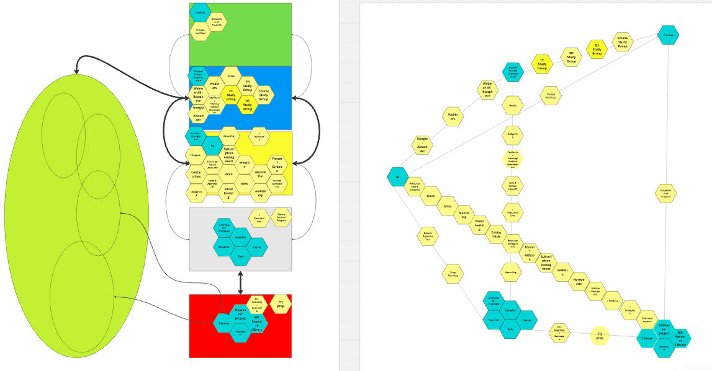
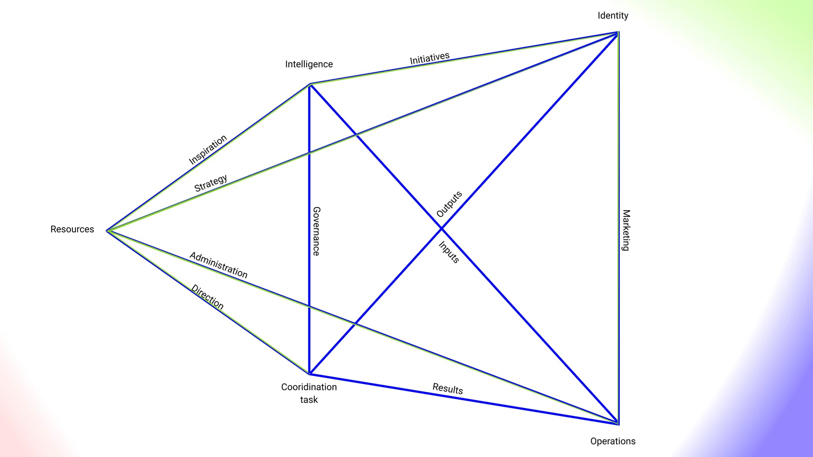
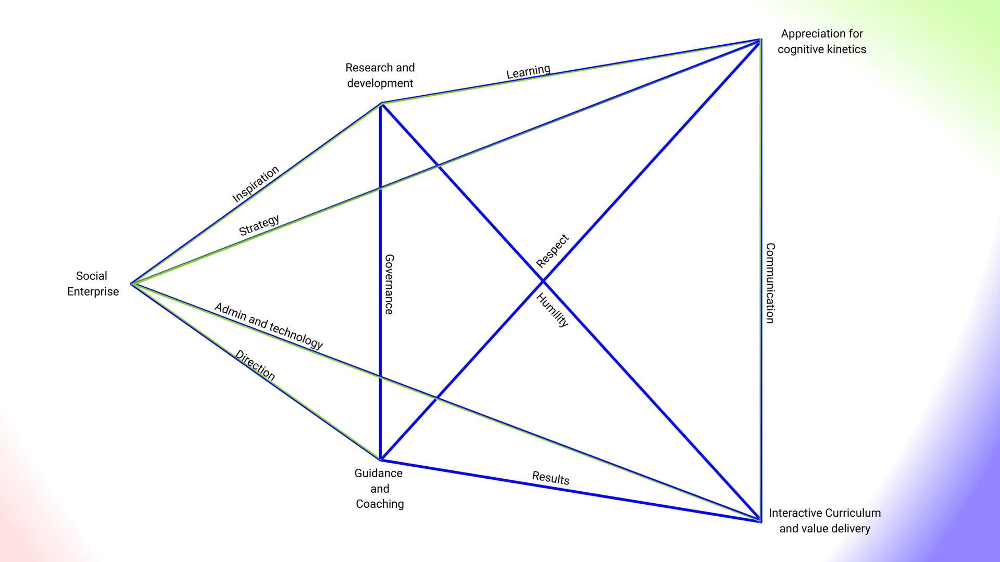

+++
date = 2025-02-15
authors = ["Josh Fairhead"]
title = "Methodology Development: Interactive VSM"
description = "A participatory approach to the Viable System Model using pentadic representation"
[taxonomies]
tags = ["VSM", "Systems Thinking", "Methodology", "Cybernetics"]
[extra]
banner = "vsm-banner.jpg"

+++

## Context

Having played with the VSM for some time and swam around the Metaphorum space a little I believe the model to be pretty useful, but perceive a massive UX issue.

For instance, many people at Metaphorum were hitting a bootstrapping issue where they had to sell the client on the model to get the investment to teach (indoctrinate) them about the model, rather than simply realising the models 'emancipatory' power.

There is nothing particularly wrong with the model, but the approach that's being taken is of Horizon one learning; in other words indoctrination through presentation. While at Metaphorum in 2023 and 2024 it became apparent to me that these models are essentially toy's to be played with, and if they are to be emancipatory they should probably be less about the information and more about the shared practice…

## Development History

During a visit to Metaphorum in Manchester 2023 - organised in part by Ian Kendrick - I found the that the VSM was much easier to make sense of and remember when represented through the lens of a pentad. At one point or other Anthony Hodgson offered five node labels which were useful attractors for retaining information while visiting, and it also felt more in line with Staffords later work which was more geometrical in representation.

This was how I learnt the core concepts in 2023, but I found the 'nodal buckets' approach a bit prone over flow; which is notably the approach taken by the VSM canvas. What happens is that you end up a bit overwhelmed with a lot of content that sits in a heap lacking context.

By 2024 I was trying to better grasp the links of the pentad, which are given in QS terms, but without a second instance to compare against I was struggling to come to grips with them. Around this point Ian Kendrick shared document with a 'viability assessment' by Anthony Hodgson… Gold!

The representation was not the standard VSM diagram, nor a pentad, but some bricky flowers somewhere between. Regardless, it had the connectives I needed for my research so I noted them down for safe keeping. Around this time there was also a lot of stuff happening with the Pioneers, but none of it seemed particularly contextualised; in other words it felt like there was a lot of action that made little sense to an outside observer, even those like me attending weekly meetings.

At one point there was a hexagon dump so I took all the material and filtered it through the pentadic VSM representation as a diagnostic and things became a lot clearer. While this was useful in isolation, I believe that the representation is probably a pedagogical tool that solves many of the issues mentioned above. In other words for the VSM to be emancipatory, it needs to be participitory and accessible, which the pentadic representation solves for.

Here is an image of some prototyping:

## Method

#### Step 1
Open the relevant canvas on a board.

#### Step 2
Discuss either:
- the labelled nodes and edges and record articulations that come up on hexagons
- matters of concern and record articulations that come up on hexagons

#### Step 3
Place hexagons in relevant positions on the canvas.

#### Step 4
Reflect on wholeness, rearrange as necessary and use for further diagnostics and tracking agendas, tasks, initiatives etc. Get a little creative and think of possibilities.

## Canvas

### Generic VSM Pentad

### H3uni Specific

## Notes

These representations were shared on a whiteboard and discussed with members of the Metaphorum community in 2024. Most responded positively, especially Martin Pfieffer, who offered some help ensuring representational integrity based on his knowledge of the VSM.

Further variations and refinements could still be made, should others take an interest in offering their own interpretations. The goal however is less to question the semantics (as much is drawn from Tonys work) but to move away from Horizon one presentations, towards Horizon three learning through praxis and play.
