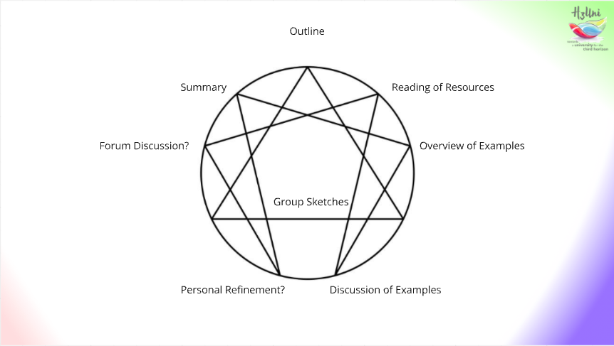
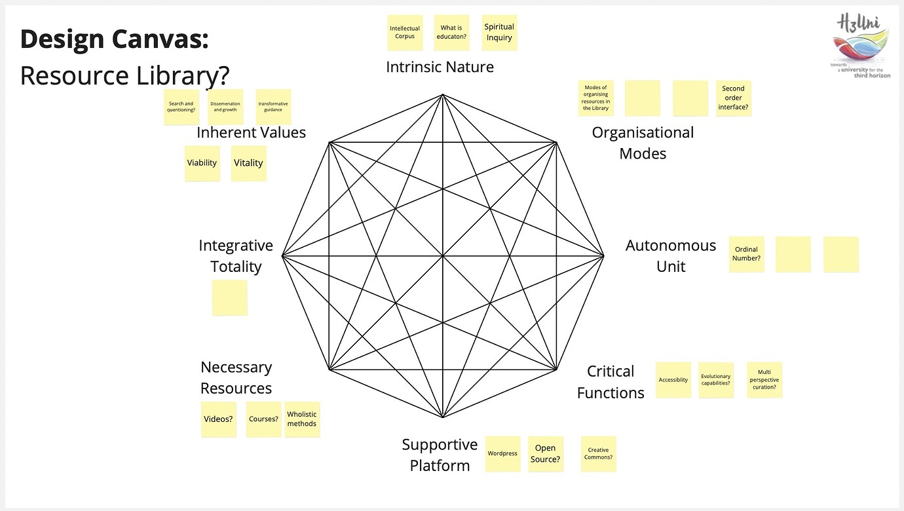
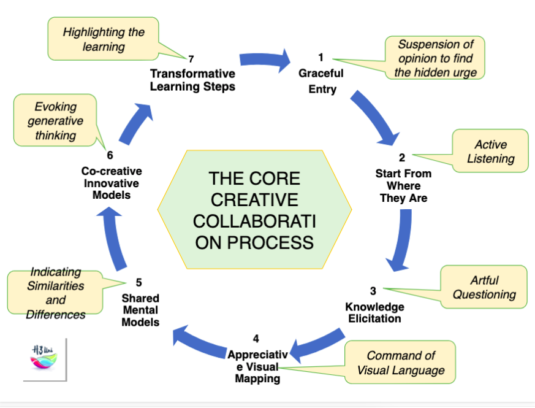

+++
date = 2025-02-06
authors = ["Josh Fairhead"]
title = "Methodology Development: Monastic Design"
description = "Exploring QualSystems as a dialogic design tool through experimental practice"
[taxonomies]
tags = ["Methodology", "QualSystems", "Octad", "Design", "Facilitation"]
[extra]
banner = "banner.jpg"

+++

## Context

In Mondays QS Study Group, participants experimented with QualSystems as a dialogic design tool for about 30m. As an experimental instance of applying QS methods to visual facilitation, it seemed relevant to document some of the learnings and share them here.

The study group gathered to discuss the structure of the octad and an outline of the session intent was shared in the form of an enneagram so wonky that would probably make Gurdjieff weep. Here is the slide for reference:

The group then read the material from Tony's QS book and skimmed some examples as an overview. Phil (@ptatenz) then took us through an analysis of an advanced example which Night Hawk (@anthony.hodgson) had previously shared on public transport, this then led to further discussion about the theory, particularly nodes within the arena. As discussion drew to a close on this, we drew our attention towards practice with a very loosely framed workshop on a coordination task with plenty of shared context.

## Task

The essential task was simply to coordinate some form of applied group study as praxis learning. However to accomplish this exercise, an existential task was necessary; in this case designing the H3uni resource library.

## Method

Dialogue about a shared frame and topic of reference, visually facilitated with a very light touch.

## Process

Participants were instructed to contemplate the core grammar or terms of the octad, before reformulating them as questions in relation to the existential task. These were then to be offered to each other, with answers documented on sticky notes. In retrospect, the form reminds me of monastic debate; so perhaps the process, or at least this first step, can be called "monastic design"?

## Result

## Learnings

Conditions here were exceedingly favourable for something to emerge and the session could have gone south pretty easily in other contexts; participants knew each other, meet regularly, are familiar with the base methodologies and subject matter, meaning that both frame and task had been discussed for a considerable length of time (formally and informally).

Taking the outer terms and re-framing them as questions seemed agreeable and generative within the context of this group, allowing participants to propose interpretations and co-create the frame of inquiry, which had a causal texture that felt somewhat 'Ratna' to my own senses:

- **Positives** include lively and innovative discussion with little disagreement requiring very little intervention.
- **Negatives** include a sense of unresolved scope creep towards the end of the workshop, that in a larger group would become untenable - though not particularly uncomfortable in this instance.
- **Ambiguous** elements include the process of reformulating the core grammar into questions as a method that somewhat emerged from the context of the study group. The lack of definition contributed to scope creep, but also generated a lot of meaning making within the group about the deep structure. There's a sense that we got lucky as the approach seems to align well with step one of the core collaborative process, though seems unlikely to work out in the long run as a set it and forget it strategy.
- **Indeterminate** elements are perhaps things the lack of evaluation criteria to judge success or failure by. At the essential level we discussed the octad in a practical way and began to use it in practice around a specific task - which is a desirable result, while on the other hand the resource library is a rather large project with a long and slow feed back loop making existential results indeterminate.

Would practitioners be interested in discussing the build out of a 'this' still very open method? It would be great to get feedback from experiment participants about their sense of the causal, as well as how to 'dance hammer' this octad into something similar yet different to and from other methodologies like the Wheel of Wisdom.

My core learning here is that if methodologies are developed from the generic octad, they are probably then 'coloured' by the specific task or activity - such as the resource library in this case, which in turn when stated out loud reminds me of the heptad of design (light, colour, lines, form, texture, pattern, space). Having wondered how various courses and methodologies form, I'm starting to wonder if our little study group lucked into the first step?

