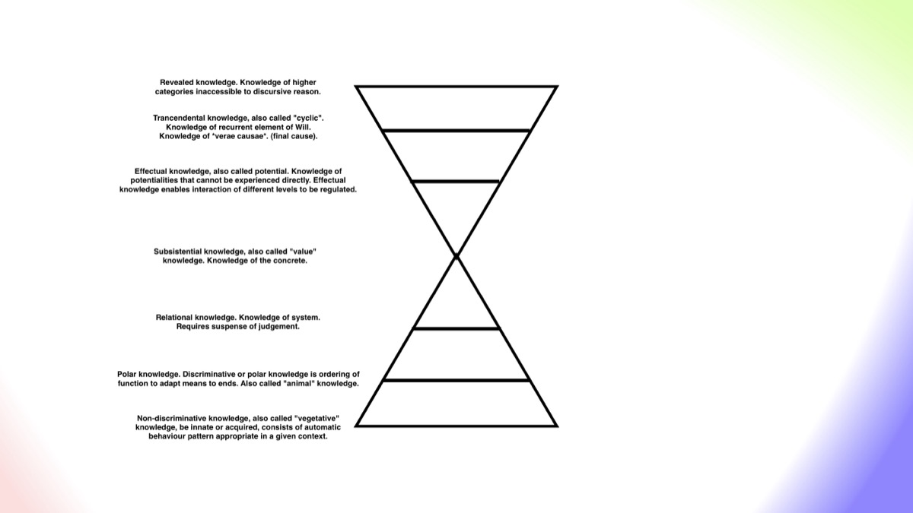
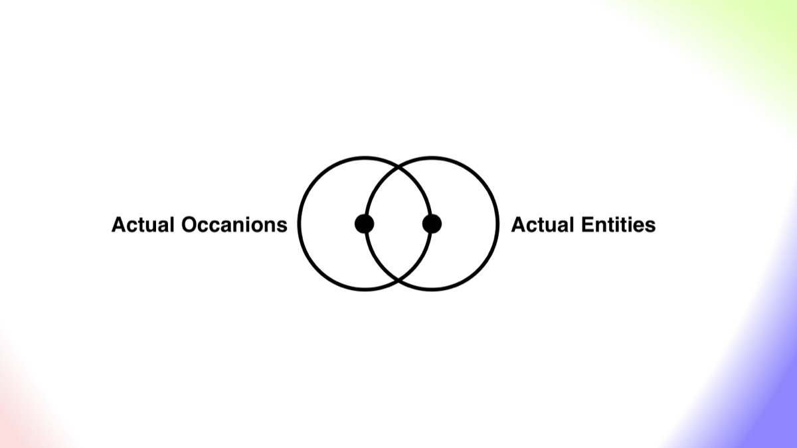
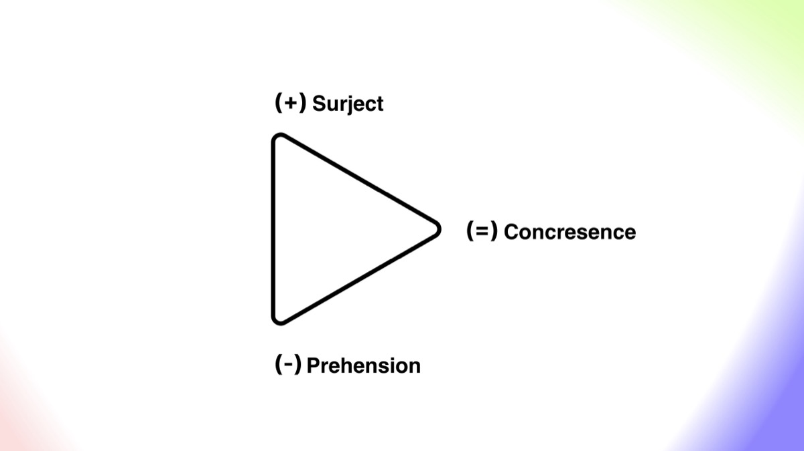

+++
date = 2025-11-01
authors = ["Josh Fairhead"]
title = "Process Thought and Science 2025 (Session 4)"
description = "Participatory science"
draft = false
[taxonomies]
tags = ["Process Philosophy", "Whitehead", "Bennett"]
[extra]
banner = "session-4-thumbnail-v2.jpg"
banner_style = "object-position: center center;"
styles = ["lightbox.css"]
scripts = ["travel-lightbox.js"]

+++

The session opens with the question of "what would a non-bifurcated science look like?". Whitehead's critique on the bifurcation of nature - the separation of quantity from experiential quality - suggests there's no justification to make this kind of split other than as a shorthand to emphasize the measurable aspects of science.

In other words there is no separation between the red hue of a sunset and the electromagnetic radiation that the physicist would measure and talk of. It's this qualitative science that Goethe was working on about a century before Whitehead, when he states that we are the most precise instrument for the observation of nature that one could ask for - not that either were opposed to using instruments. The statement would appear to be more of a concern that we might lose our sense of proportion by allowing science being subsumed by material instruments and therefore losing touch with life and mind, seeing them as unimportant impositions in a well behaved universe.

Already I'm seeing parallels with Bennett's work in the DU1 which gives language to these concerns. He would say that they feared that "discriminative knowledge" would subsume "relational knowledge" and forms beyond these. To be precise Bennett defines knowledge as:

The subjective aspect of function. The ordering of function. Knowledge of seven kinds.

What Goethe and Whitehead seem to be pointing at, are the categories above what Bennett named to be 'animal' or 'polar' knowledge. The exact category is hard to put a finger on without going deeper into their work and drawing out comparisons but these authors seem to be at least pointing at "relational" knowledge as indicated by the quote: "Human experience is an act of self origination inclusive of the whole of nature limited to the perspective of a focal region within the body."

At this moment Matt takes a moment to clarify Whitehead's notion of 'actual entities', stating that the universe is composed of actual entities, often wrongly identified as tiny quantum events which is not what Whitehead suggests. This is apparently because an actual entity is not a particle but an abstract category. There seem to be a few matters at play in this section; 1) an actual entity is stated to be an abstract category, 2) a quantum event is claimed to be a particle which it is not, (it's a process of change from one state to another) and 3) it's stated that in an attempt to avoid the fallacy of misplaced concreteness Whitehead engages in some extreme feats of abstraction.

Addressing these concerns seems to mostly be a language issue, because if a quantum event were a particle it would probably be an instance of the metaphysical class of 'actual entities' which appears to be a generic placeholder of units of existence. However a quantum event is not a particle and therefore cannot be an actual entity, it is more likely an 'actual occasion' in Whitehead's terminology. So having corrected the premise, Matt is right, but only because the premise he laid out is faulty - or so it would seem.

The wave/particle, entity/occasion continuum is not explicitly pointed at in the video but I assume this is what is being pointed at by the discussion on Zeno's paradox, where it's pointed out that our mathematical analysis of motion and empirical observations of motion seem to be in conflict - which once again points out the age old paradox of discrete or continuous reality. The take away here seems easiest to relate through Bennett's Dyad; which is the notion of complementary polarity (rather than dualities that are essentially antonyms).

So for clarity I'm going to state my own understanding of 'actual entities' and 'actual occasions' as complementary poles of a dyad that forms a class which encapsulates the instances of actual entities/occasions as 'particles' and 'waves'. This much seems pretty clear although the relationship with other abstractions such as 'nodes' and 'edges' are perhaps less clear.

Apparently Whitehead attempts to resolve this paradox between continuity and discontinuity, through pulses of actualisation or 'actual occasions' that act as drops or impulses. At this point atoms are mentioned in likeness, but with the distinction that they are used in this context as indivisible wholes, as per the Greek meaning, rather than as parts. Rather than representing this notion of 'wholeness' as say a collection of parts, say a jar of marbles, a less physical notion of 'wholeness' emerges than the whole/part holon, one that is similar to a scale free and infinitely recursive hologram, expressed in the following mantra:

"Om purnamadah purnamidam purnat purnamudachyate / purnasya purnamadaya purnamevavashishyate", which translates to "That is whole. This is whole. From wholeness emerges wholeness. Wholeness coming from wholeness, wholeness still remains".

Alternatively, if a rich narrative structure is preferred to convey the idea of 'actual occasions' as indivisible or holographic wholes, we can draw on the parable of the Buddha and the Monkey King:

<iframe width="560" height="315" src="https://www.youtube.com/embed/_58XBCxg9Nw?si=n8uFKNrFf_RXN9w_&start=512" title="YouTube video player" frameborder="0" allow="accelerometer; autoplay; clipboard-write; encrypted-media; gyroscope; picture-in-picture; web-share" allowfullscreen></iframe>

As we might understand from these representations, we are not just working with one whole but a collective becoming that gives rise to new wholes, or actual occasions, where the whole universe is felt and unified in each occasion - bringing forth new perspectives that arise, endure for a time, and then perish. A universe which grows like an embryo and divides, like a cell theory of actuality paying homage to how nature organizes. It's also emphasized that this collective becoming can be a society of occasions where many actual occasions are in a temporal flow that carries the past forward into the future in a process of concrescence (a word which essentially means to grow together).

The explanation given with regard to the notion of concrescence is that we have a continuum from physical to mental, or objective to subjective, whereby the physical pole inherits the prehensions of the past and is lured towards a subjective aim. Only some of these sensed possibilities, or prehensions, are actually relevant and the majority are negatively prehended (taken into account but excluded). The physical pole conceptually ingresses into the mental pole where the prehensions become what is called a superject, which subsequently dies to itself in order to become objective data in the future and repeating the process as a new prehension. This consequentially evolves ever more complex 'societies of occasion' where more and more possibilities can be explored, rather than simple repetitions of the past.

My interpretation of this is somewhat along the lines of the blind men touching the elephant. Each individual is prehending different creatures, the trunk as a snake, the tail as a brush etc. In doing so their expressions become a society of occasions that eventually concresce/coalesce together into a superject elephant. This might really be a bunch of coders, mathematicians or hippies codifying their perceptions together, and in an act of collective becoming a new creation is born be it an application, mathematical theory, design or religious narrative.

Speaking of religious narrative, this juncture brought the discussion into process theology and Whitehead's notion of God. The idea here is that the idea of God functions as the lures of feeling, the primordial nature of which holds together all the actual occasions and relationships of all the patterns that have ever been actualised - along with the concreted/coalesced actual occasions in eternity. The claim that this is necessary in order for the laws of nature to persevere. In other words the primordial rather than consequent nature of God is the ordering and limitation of potentials. God here is an actual entity but not an occasion as occasions must be finalized, which an eternal entity cannot be.

Having covered much ground here, it would seem that the easiest way to summarize the key points is to boil things down into a dyad of 'actual entities' and 'actual occasions', which give rise to dynamics of 'prehensions' that 'concresce' into a 'superject'.

