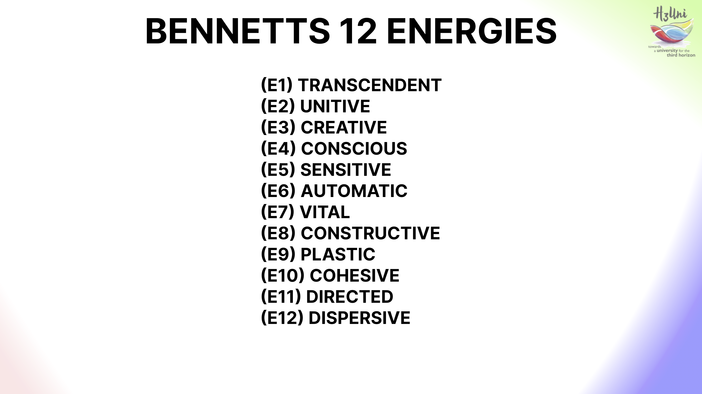

+++
authors = ["Josh Fairhead"]
title = "Energies; material, vital, cosmic"
description = "A exposition of energies by John Bennett"
[taxonomies]
book_tags = ["Book"]
[extra]
banner = "cover.jpg"

+++

How come at points in my life I'm crackling with as much energy a tesla coil, while at other periods it feels as though I've a rubber soul? What determines the quality, quantity and intensity of this phenomena? Can answers be harnessed towards human flourishing at personal, local and global levels? 

While I have no clear answers, we might be able to draw some inferences based on John Bennetts lifetime of studies, in particular his schema of the twelve energy levels. These have also been taught at H3uni.org by Anthony Hodgson as part of the Cosmic Ecology course. 

Having attempted to climb the mountain of John Bennetts Dramatic universe series myself, I can share from experience it's an exceptionally dense rock of knowledge. The book "energies; material, vital, cosmic" is a set of crumbs from that ideas table, and significantly more digestible for such a reason - in other words what a bloody great book! 

Essentially the book is a set of lectures about Bennett's twelve levels of energy and the pentadic diagrams used to articulate the eight cosmoses of reciprocal maintenance. As Gurdjieff would have put it, this schema is about learning "to do" through the "laws of world creation and maintenance" - though the material is more informative than pragmatic. 

What I mainly took from this book is a correction to my thinking process and some fresh inspiration for thinking about questions like "what is photosynthesis?" or "does free energy exist?". Here Bennett's descriptions of energetic levels and his systematic methodology for considering the relationships opens up a field of fresh insights, where in biology or the standard model of physics seems to get stuck. 

Investigating material energies, we get some interesting relationships, and it may essentially be that Bennett outlines the keys to Teslas free energy as the crystalline cosmos. At the very least he seems to be waaay ahead of the curve detailing what appears to be extropic.ai's hardware acceleration. 

In this case the crystalline cosmos is composed of five energies; E12 dissipative, E11 directed, E10 cohesive, E9 tensile, E8 vital. The names are descriptive of their qualities, though can be substituted with other attributes, which help to further clarify their essence. 

So by recycling heat, directing it, organising it, concentrating it and releasing it in a desired pattern an anabolic reaction is created. At the same time, inefficiencies in fitting the pattern and so forth creates a catabolic reaction which produces waste in the form of heat. It would seem that this can be maintained in perpetuity by a 'sorting daemon' which requires little if any energetic input by simply skimming the necessary energy from flows occurring between chambers, which is illustrated in the book. 

In theory this sounds good but we still might want to test it out, although retroductivly drawing on personal experience it seems about on point regarding cycles of hyperstimulation and burn out. Coincidentally, in Bennetts schema of energies this 'burn out' modality may actually be the excessive weight of higher energies like conscious energy which is likened to a black flame, or the sun in Platos cave where those exposed to such energy wish to withdraw back into the comfort of darkness... Couldn't tell you, but talk about an interesting reframe! 

So that's it for the book review, we can probably discuss the subject of energies in significantly more depth by using methods like systematics and qualsystems to tease out links and relationships between the modalities. The subject of another post however! 