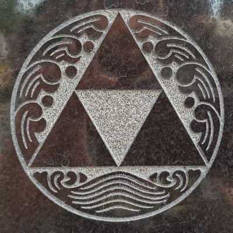

+++
authors = ["Josh Fairhead"]
title = "Semiotics in Brief"
description = "An exposition on the work of Pierce"
[taxonomies]
tags = ["Exposition"]
[extra]
toc = true
toc_sidebar = true

+++

# Introduction

Semiotics is essentially the study of significance, or as it is often put the study of signs, signifiers and the signified. While no expert on Peirce, the patterns of his thinking seem to be foundational thinking within Bennetts theories on the qualitative significance of number, or Hodgsons Qualsystems/Qualitative Systems Thinking. Personally speaking, this is what makes Peirce's work interesting for me.

Peirce defines semiosis as the action of signs; which can be thought of as the dynamic correlation between objects, signs and interpretants. In this case objects are a form of presentation, signs are a form of re-presentation, and interpretants are the inferential communicative meanings.

Peirce articulates a form of ternary logic based on categories are called 1stness, 2ndness and 3rdness. To my reasoning equate to schemas like Gurdjieffs active, passive, reconciling or Bennetts function, being, will or Landrys immanant, omniscient, transcendental. These are essentially qualities that can be found in everything, though Peirce starts from his own entry point and attributes his own specific meanings to these descriptions.

# Categories

The first category, 1stness, is analogous to Bennetts function; an essentially pure quality that exists without relationship and is separate from any object. The Greeks probably would have called this an 'accident', or a 'property' of something with the possibility of embodiment like colours of feelings. Monism.

2ndness then appears to be a form of dyadic being in relation to another; subject and object, cause and effect, action and reaction, dependence and independence, here and now, force and resistance, essential and existential, first and last, nihilism and eternalism, nominalism and positivism, etc. Relation here seems to be defined largely through opposition.

3rdness then appears to be a continuum between things, mediation and regulation of patterns which enable us to gain information and learn about the state of affairs. Bennett would probably attribute dynamism and reconciliation as properties belonging to this category, as would seem proper, and this seems implicit in Peirce.

# Correlates

Based on these three categories Peirce establishes three classes; presentation, representation and interpretation:

- The first class is the sign itself, regardless of what the object is represents or the effect it produces. What can be said about the sign or object directly? What's it's tone, token or type?
- The second class is about how the sign represents an object regardless of effect. How does the sign stand for or denote a related object? Is it an icon, index or symbol?
- The third class describes the communicative effects such as emotions, actions or thoughts. How does the sign represent its object to the interpreter? Is it a term, proposition or argument?

# Nine Genuine Types of Sign

Crossing correlates and categories and we get the 'nine genuine types of sign'

| | Correlate 1 (+) | Correlate 2 (-) | Correlate 3 (=) |
|---|---|---|---|
| **1stness (+)** |	Qualisign |	Icon | Rhema |
| **2ndness (-)** |	Sinsign | Index | Decisign | 
| **3rdness (=)** |	Legisign | Symbol | Argument |

At this point the terms within each column needs a little explaining so let's dig in.

**Qualisign** refers to a qualitative sign that is as pure as pure potential can be, meaning that it's a completely abstract **tone**. Found for instance as a pure colour or timbre.

**Sinsign** refers to an impulse that exists and imposes into the world here and now seperated from reason - this is otherwise referred to as a **token**. For example the sound of thunder or a note.

**Legisign** then refers to a **type** of law, rule or convention that is general or universal in nature. Examples that come to mind are chord constructions like major sevenths, which then regulate and determine the particular notes, or alternativly a mathmatical formula that governs a set of variables.

**Icons** are signs based on similarities or resemblances, in other words they are forms of mimicry that in a pure form would have no marked differences. One can take art as an example, where an illustration would represent the life model.

**Indexes** then are signs based on material or causal connections, the key words being matces or fit; for instance finger prints represent the lines on your hand. You could also say that measurements like weight or tempreture are indexes too.

**Symbols** then are signs where the relation to an object is based on habbitual conventions, an example of which might be the emergency exit where icons are used to explain an idea in reference to a physical index (the door below it). These have been called idons in other languages and domains.

**Rhema** is an ephemearal qualitity with the possibility of interpretation such as a sensation or feeling. As it's of a subjective nature that can neither be affirmed or denied, rhema conveys no factual information. Logically rhema can be concieved of as a proposition without a subject; "___ is a state".

**A dicisign** as the concrete instance then claims factual information about the world. It can be considered the result of an inductive proposition, where a hypothesis is tested through experiment. For example "42 is the meaning of life, existence and everything" represents a claim which upon interpretation can be affirmed or denied.

**An argument** then poses a conclusion to the union of many propositions as a necessary answer which produces an ordered and lawful effect. Such sequenced propositions guide us toward a conclusion with purpose. Formal logic like syllogism, guiding principles or meta structures can be considered arguments.
Ten Genuine Signs

At this point it's very tempting to draw an enneagram with the above categories and correlates, which would probably be structured 1-9 around the edges of a circle in the order of writing; and most likely the inner hexagram would reveal some interesting information about the linkages (such an assertion boarders on dicisign).

However, Peirce did something else that was quite interesting, he derrived ten triadic configurations by combining categories and correlates based on as simple rule of allowing movements of only sideways or up; these, he called the 'ten genuine signs'. If your serious about this material, and my description of this method doesn't make sense to you, you can reverse engineer the process by comaring the triads and formalisms with the nine types above while looking for patterns.
| Formalism | Triad of terms | Description |
|---|---|---|
| 111 |	Qualisign, Icon, Rhema | A sign of possibility is precieved to be, similar to a possible object, producing a possible emotional effect |
| 211 |	Sinsign, Icon, Rhema | An individual sign is considered to be, connected to an existent object, producing a possible emotional effect |
| 221 |	Sinsign, Index, Rhema |	An individual sign is considered to be, similar to an existent object, producing a possible emotional effect |
| 222 |	Sinsign, Index, Deicsign | An individual sign is considered to be, similar to an existent object, producing an actual energetic effect |
| 311 |	Legisign, Icon, Rhema | A habitual sign represents, the qualities of its object, producing a possible emotional effect |
| 321 |	Legisign, Index, Rhema | A habitual sign represents, by being existentially connected to it, producing a possible emotional effect |
| 322 |	Legisign, Index, Decisign | A habitual sign represents, by being existentially connected to it, producing an actual energetic effect |
| 331 |	Legisign, Symbol, Rhema | A habitual sign represents, its object by a habbit producing, a possible emotional interpretation |
| 332 |	Legisign, Symbol, Dicisign | A habitual sign represents, its object by a habbit producing, an actual energetic interpretation |
| 333 |	Legisign, Symbol, Argument | A habitual sign represents, its object by a habbit producing, a general logical interpretation | 

That's the baisics of the theory in a nutshell, though Peirce talked of many other interesting things that are worth learning about of which I've barely scratched the surface of myself. For example, he considered Philosophy to be constructed from phenomenology, normative science and metaphysics. Double clicking on normative science, he considered this to be constructed of ethics (action), aesthetics (feeling) and logic (thought).

If your into qualitive systems thinking and cognitive semantics, Peirce is a pretty interesting writer to steep in for a while. Although he argues that terniary logic is both necessary and sufficient for proper reasoning as everything higher order systems are made of binar or ternary pairings, he still takes his investigations to further depths by varying combinations (e.g. his 6 universal predicments) and tracing paths (10 genuine signs).

In my view he could go further unfolding the qualitive significance of number but unearthed and articulated some important foundations none the less, and for that we owe him a debt of grattitude. Great stuff.
