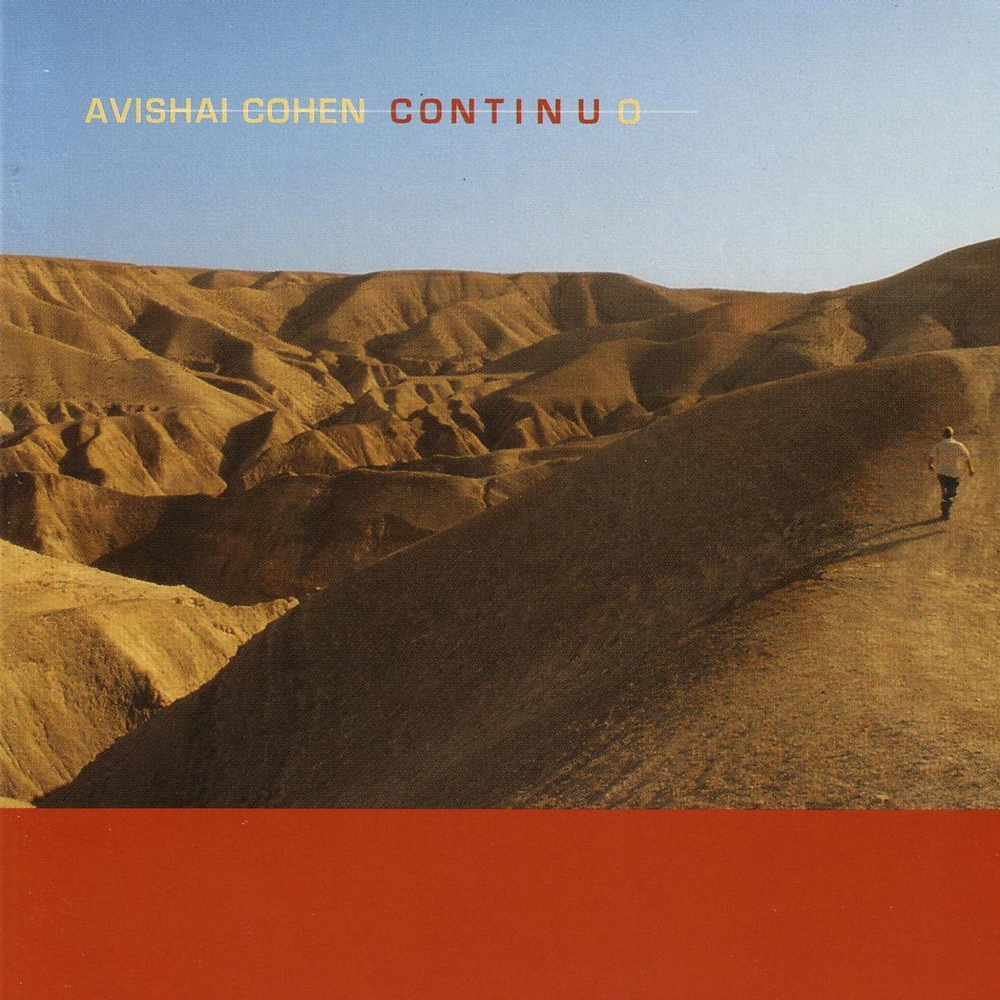

+++
authors = ["Josh"]
title = "Avishi Cohen"
description = "Organic landscapes channeled through a most competent contemporary trio."
[taxonomies]
music_tags = ["Album"]
[extra]
hero = false
banner = "continuo.jpg"
+++

	

		<a href="https://youtube.com/playlist?list=PLoxhDWWBCgefXsfrPmbktRpAmreYVgOGy&si=HvnSikRTuue3_zgg" class="album-link" target="_blank" rel="noopener noreferrer">
			
			
Continuo

		</a>
	

Album: [Continuo](https://youtube.com/playlist?list=PLoxhDWWBCgefXsfrPmbktRpAmreYVgOGy&si=HvnSikRTuue3_zgg)

Double bass, drums and piano is all you need as an Israeli jazz trio. The drum and bass rhythm section gel particularly together but the keys are still a very nice touch that couldn't be done without. 

The album [Continuo](https://youtube.com/playlist?list=PLoxhDWWBCgefXsfrPmbktRpAmreYVgOGy&si=HvnSikRTuue3_zgg) is a graceful journey through what feels like a desert, through many a figurative "[emotional storm](https://youtu.be/JURBuEQA1sM?si=Td5egJlLLcoXICMt)". It has a breadth, depth and a vastness that I've not heard on many other albums and it feels extremely authentic and honest in its underlying nature.