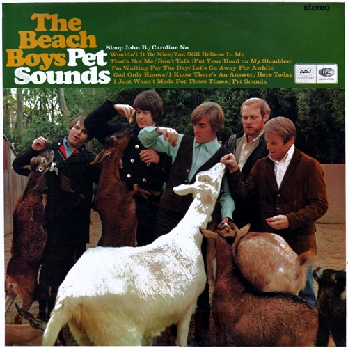
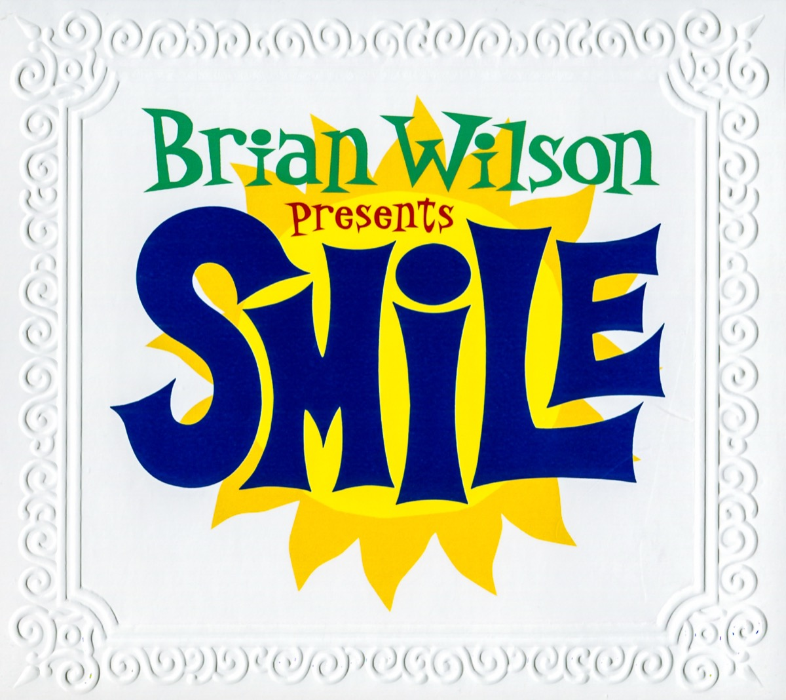

+++
authors = ["Josh"]
title = "Brian Wilson"
description = "Beach boys creative genius and author of one of the most interesting lost albums of all time."
[taxonomies]
music_tags = ["Artist"]
[extra]
hero = false
banner = "smile.jpg"
+++

	

		<a href="https://youtube.com/playlist?list=PLj5TmO4kroQH4XM8P3JavV0p7Gtnno1E2&si=s1o2VfbFTFdpBE8A" class="album-link" target="_blank" rel="noopener noreferrer">
			
			
Pet Sounds

		</a>
	

	

		<a href="https://youtube.com/playlist?list=PLhinduWcIKtFcHEDIQPXXdbFGT8gxTKF1&si=rPcZTkaZfCu9TkGv" class="album-link" target="_blank" rel="noopener noreferrer">
			
			
SMiLE

		</a>
	

Albums: [Pet Sounds](https://youtube.com/playlist?list=PLj5TmO4kroQH4XM8P3JavV0p7Gtnno1E2&si=s1o2VfbFTFdpBE8A), [SMiLE](https://youtube.com/playlist?list=PLhinduWcIKtFcHEDIQPXXdbFGT8gxTKF1&si=rPcZTkaZfCu9TkGv)

You know the Beach Boys right? Well Brian Wilson was arguably the driving talent behind most of their sucess; he wrote most of the songs, the arrangements, hired the musicians and ran the studio production. Obviously "[Pet Sounds](https://youtube.com/playlist?list=PLj5TmO4kroQH4XM8P3JavV0p7Gtnno1E2&si=s1o2VfbFTFdpBE8A)" was the album that reached fame and critical acclaim due to the pioneering studio productions on the hit "[Good Vibrations](https://youtu.be/apBWI6xrbLY?si=kOLkjBi9cSyXYpMj)".

What many people don't know however is that there was a follow up album that made use of the same pioneering techniques as "[Good Vibrations](https://youtu.be/apBWI6xrbLY?si=kOLkjBi9cSyXYpMj)" that was was LOST for 40 years. This was Brians masterpiece, which finally saw the light of day in 2004. Naturally, there's an incredible story behind the albums history, with several documentaries like "[Beautiful Dreamer](https://www.youtube.com/watch?v=JETqt5e5OQQ)" available that one should really take the time to watch for themselves. As such, I'll leave that aspect alone. 

Anyway, thanks to members of "[The Wondermints](https://www.youtube.com/watch?v=-9K-YmhCmlA)" helping Bryan get back on track - particularly Darian Shanana - the 2004 version SMiLE is frankly the most spiritual album your likely to find for miles; the ProTools recording is an audiophiles wet dream with luscious vocal harmonies, wall of sound instrumental arrangements (inclusive of barritone harmonicas) and a brilliant sense of psychedelic humour! 

As a concept album, there are several elemental themes woven into the albums fabric. For me the water sections transition between "[Child is Father of the Man](https://www.youtube.com/watch?v=MCoweCaRn5U&list=OLAK5uy_mR9pK5phEHUR__YHG9xj4rgPwzmDQpKt4&index=9)" and "[Surfs Up](https://www.youtube.com/watch?v=MCoweCaRn5U&list=OLAK5uy_mR9pK5phEHUR__YHG9xj4rgPwzmDQpKt4&index=9)" has a shimmering depth, thanks to the Stockholm Strings and their emotive glissando's. Theres plenty of substance to the album, just get in for a swim!