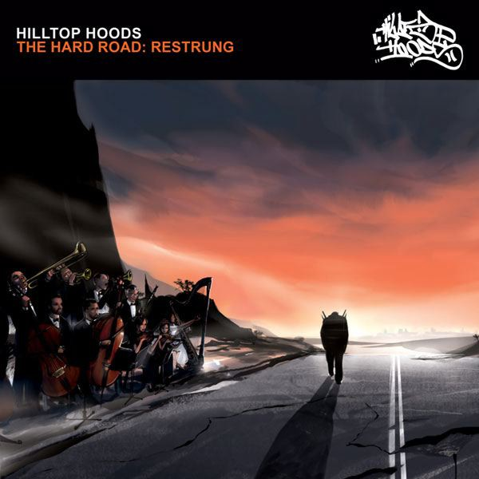
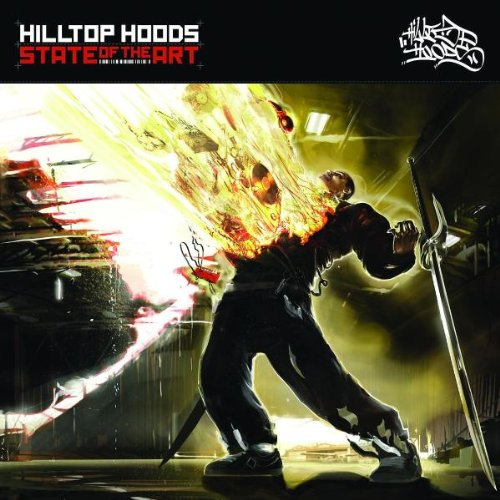
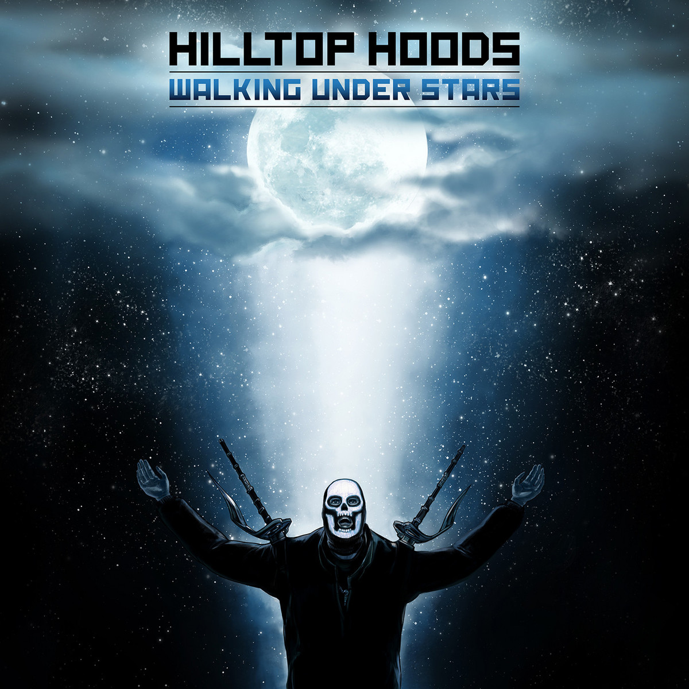
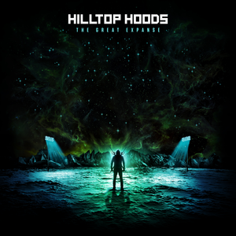

+++
authors = ["Josh"]
title = "Hilltop Hoods"
description = "Authentic Australian hip hop full of struggle and soul."
[taxonomies]
music_tags = ["Artist"]
[extra]
hero = false
banner = "the-hard-road-restrung.jpg"
+++

	

		<a href="https://youtube.com/playlist?list=PLo9q22mJbXz-UWtijhhNQmcNbOIQ4a4kN&si=38yFGGq71fVlCmk5" class="album-link" target="_blank" rel="noopener noreferrer">
			
			
Hard Road Restrung

		</a>
	

	

		<a href="https://youtube.com/playlist?list=PLBE870A2114A186AC&si=mMdt2qfmKmWA_Ah5" class="album-link" target="_blank" rel="noopener noreferrer">
			
			
State of The Art

		</a>
	

	

		<a href="https://youtube.com/playlist?list=PLoaSPQTUWzXhnA57elI9G86N52dMdoURY&si=Hw7hXqraA9hzJ2nO" class="album-link" target="_blank" rel="noopener noreferrer">
			
			
Walking Under Stars

		</a>
	

	

		<a href="https://youtube.com/playlist?list=PLoaSPQTUWzXiAf6m-ni1NZQxxQsPeGnSv&si=EYAO3Id_Q5GET8id" class="album-link" target="_blank" rel="noopener noreferrer">
			
			
Drinking from the Sun

		</a>
	

	

		<a href="https://youtube.com/playlist?list=PLoaSPQTUWzXj_0YC49ym8ycrKEc-haMsX&si=7Uu5mu9mGx7WeQAZ" class="album-link" target="_blank" rel="noopener noreferrer">
			
			
The Great Expanse

		</a>
	

Albums: [Hard Road Restrung](https://youtube.com/playlist?list=PLo9q22mJbXz-UWtijhhNQmcNbOIQ4a4kN&si=38yFGGq71fVlCmk5), [State of The Art](https://youtube.com/playlist?list=PLBE870A2114A186AC&si=mMdt2qfmKmWA_Ah5), [Walking Under Stars](https://youtube.com/playlist?list=PLoaSPQTUWzXhnA57elI9G86N52dMdoURY&si=Hw7hXqraA9hzJ2nO), [Drinking from the Sun](https://youtube.com/playlist?list=PLoaSPQTUWzXiAf6m-ni1NZQxxQsPeGnSv&si=EYAO3Id_Q5GET8id), [The Great Expanse](https://youtube.com/playlist?list=PLoaSPQTUWzXj_0YC49ym8ycrKEc-haMsX&si=7Uu5mu9mGx7WeQAZ)

As the name might suggest, Hilltop are indeed one of Australias biggest hip hop acts - though I'm pretty sure their name came before the fame. Whatever the case it's well deserved as lyric wise the two MCs are beyond first class wordsmiths. Earlier albums are seemingly less personal and more raw, while later albums are considerably more personal with a pop edge. This is a small price to pay for the added depth and dimensionality and quite frankly the production grows on you. 

Walking Under Stars is probably the darkest period of the bands tenure, with "[Live and Let Go](https://youtu.be/Ka16zZEVOVs?si=yy45aCDWynuGRHzQ)" as one of the more profound pieces of lyrical prowess, where guest MC Brother Ali and Pressure drop some [lines that are beyond poetic](https://genius.com/Hilltop-hoods-live-and-let-go-lyrics). I'll not labour how good this group is though, as I've a more refined post to drop related to the Hilltop Story.

