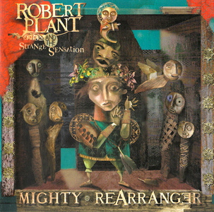
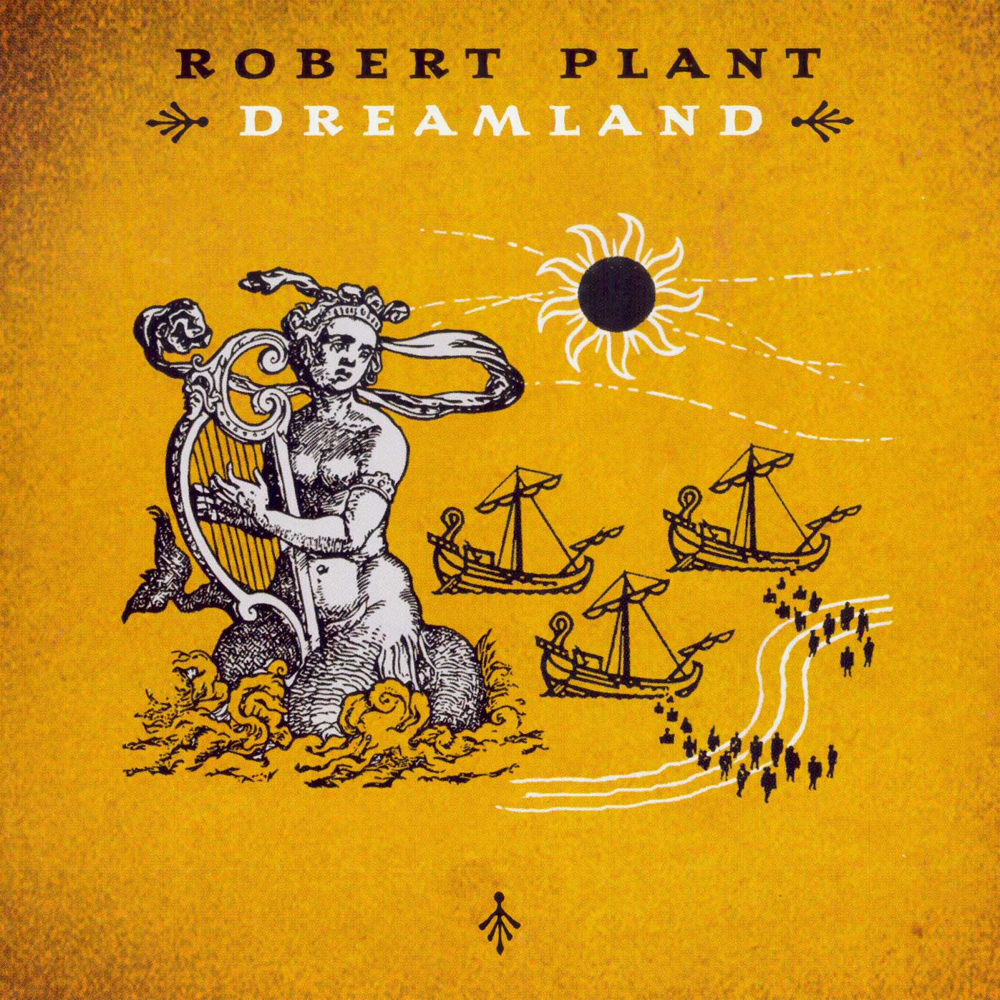

+++
authors = ["Josh"]
title = "Robert Plant"
description = "Led Zeppelin's rambling man fronts his own career as a solo artist."
[taxonomies]
music_tags = ["Artist"]
[extra]
hero = false
banner = "mighty-rearranger.jpg"
+++

	

		<a href="https://youtube.com/playlist?list=PLWmdrxukffoAZlaeNfzur4uBfLFTKFlSz&si=CIV0giyUUpgQRIwp" class="album-link" target="_blank" rel="noopener noreferrer">
			
			
Mighty Rearranger

		</a>
	

	

		<a href="https://youtube.com/playlist?list=OLAK5uy_lJEY-pBUUaZqugz6WuN4ZwhVulKh_mToQ&si=2onjwn5Yy37ASd9K" class="album-link" target="_blank" rel="noopener noreferrer">
			
			
Dreamland

		</a>
	

Album: [Mighty Rearranger](https://youtube.com/playlist?list=PLWmdrxukffoAZlaeNfzur4uBfLFTKFlSz&si=CIV0giyUUpgQRIwp), [Dreamland](https://youtube.com/playlist?list=OLAK5uy_lJEY-pBUUaZqugz6WuN4ZwhVulKh_mToQ&si=2onjwn5Yy37ASd9K)

While a lot of Robert Plants solo work doesn't really float my boat, Mighty Rearranger is absolutely fantastic! "[Another Tribe](https://youtu.be/Ry1LfNdfRt8?si=Pkumgyzvs4P45Vln)" starts the album with a rhythmic vitality that beams sunshine everywhere, which is appropriate given the second track is called "[Shine It All Around](https://youtu.be/3qp9z3IA_fU?si=fFtsvYOdLpWrTMvY)". This track is another winner on the production given it's many layred vocals and huge echo effects on the chorus - hard to believe it was recoded in a small Welsh studio. At the end of the album there's also a drum and bass remix of this tune which is pretty nice. Roberts not lost his voice or soul even at this stage of his career. 

Honourable mentions as well to the album Dreamland which is also pretty strong; particularly "Darkness, Darkness" and his cover of Dylan's "[One More Cup Of Coffee](https://youtu.be/SWUUR_BEG6o?si=wRxT3-S6w8tm_mNX)". Of course we could add a lot of the Zeppelin stuff here as well but I'm deliberately avoiding review of obvious classics as those trails are known.

---

<!--->

# First Review

<h3 style="text-align: center;">Mighty ReArranger - Robert Plant &amp; Strange Sensation (2005)</h3>
 Top notch recording here the album sounding pretty close to perfect; this is attributable to the musicians, producers and anyone else involved being the best available apart from the small Welsh studio it was recorded in; although not the finest money can buy its still equipped to a high standard...

So the first track <em>Another Tribe </em>starts with a really tight snare shuffle that putting unusual emphasis on the fourth beat of a bar which is followed by a pretty solid rhythm guitar, which is a good start to the album. The lead guitar seems to play whatever you least expect (in a musical way) and the chorus contains some interesting Indian strings.

This song then feeds into <em>Shine it All Around </em>which is the heavily produced single. It starts with a '<em>When the Levee Breaks'</em> style drum intro keeping a low profile until the chorus arrives containing multiple echoed Plants that seem larger than life; probably because of the 3-6 tightly multi-tracked harmonies. I really like the bandpass effect on the drums at about 2:20, the production is pretty excessive but does really well with not impacting the song, though perhaps its necessary when the whole track follows one chord progression...

<em>Tin Pan Valley </em>is a pretty good example of how diverse the musicians are; its essentially a drum and synth groove for most of the track with a sudden explosion about a third of the way into it. The vocals seem a quite expressive in this track but I don't like the warped echo swirl on Plants voice when the track explodes. <em>All the Kings Horses </em>follows such an outro racket which is quite a contrast given that its a quiet acoustic ballad with a super close mic'd Robert singing really quietly and then turned up in the mix. I think this vocal production on this track is exceptionally well suited to the song along with some soft cymbal hits that add a barely noticeable but smooth lift when needed.

<em>The Enchanter</em> is amongst my favourite tracks of the album, starting with a blues lick with and a subtle bandpass drums which open out on the chorus to a pristine sounding kit. This is kept for the second verse which really helps build the tracks tension in gradually segmented steps, the second chorus the bandpass comes back thinning to just low midrange before reverting again to build the guitar solo up. The production on this track is really, really good; so much in fact that it becomes a part of the composition because the song which already stands strong gets the studio treatment to really go somewhere.  So the bands pretty good thats established but if you really want to hear ultimate fusion the track <em>Somebody Knocking</em> is sure to tick the right boxes; you have blues vocals sitting on a sitar and tabla playing some form of raga backed by synts. It works well for them but the track doesn't stand out as much as the next track <em>Let The Four Winds Blow </em>which has a nicely sparse classic kind of feel, the synths make a subtle appearance as does the 'moving production' but overall has attitude to spare.  Last of the non-hidden tracks is the title track <em>Mighty ReArranger</em> which has a great bluesy/rockabilly shuffle on it along with some honky tonk piano. The intro is really well done; it starts with a great main riff and a drum pick up thats second to none landing us into the first verse. The clock effect is pretty interesting especially when the drums get bandpassed once again.  Finally we have <em>Brother Ray</em> which is seemingly just a blues jam based around a piano picked up by ambient mics, however this disappears into silence quite quickly which leads into a remixed version of <em>Shine it All Around. </em>Hats off to the DJ who did this; I'm not a huge fan of a lot of electronic music but they had a lot of taste when mutilating the track into such a brilliant drum and bass remix. I think the tracks pretty faultless in this respect due to plenty of structure, melody and rhythm; the missing ingredients in most of this musics genre. The vocoded vocals are a cool extra.

Shine it All Around: <a title="http://www.youtube.com/watch?v=oSt3x5HqiAA" href="http://www.youtube.com/watch?v=oSt3x5HqiAA">http://www.youtube.com/watch?v=oSt3x5HqiAA</a>

--->