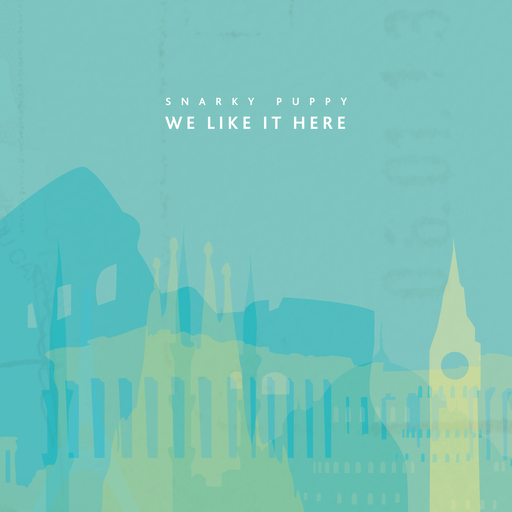
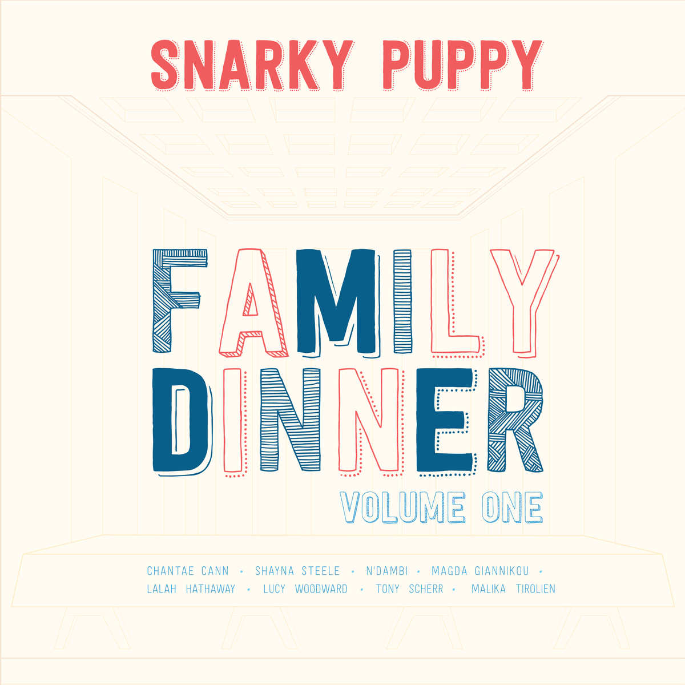

+++
authors = ["Josh"]
title = "Snarky Puppy"
description = "Metropolitan big band mixing hiphop, jazz, funk and soul."
[taxonomies]
music_tags = ["Artist"]
[extra]
hero = false
banner = "we-like-it-here.jpg"
+++

	

		<a href="https://youtube.com/playlist?list=OLAK5uy_l8-vHH2ZaYHOWEgl1XlBuuE1IA_VeFBoo&si=aehotavYqa-BMDPL" class="album-link" target="_blank" rel="noopener noreferrer">
			
			
We Like it Here

		</a>
	

	

		<a href="https://youtu.be/n7qMu_9v4P4?si=QwKPYQMmUdWb-SZH" class="album-link" target="_blank" rel="noopener noreferrer">
			
			
Family Dinner

		</a>
	

Albums: [We Like it Here](https://youtube.com/playlist?list=OLAK5uy_l8-vHH2ZaYHOWEgl1XlBuuE1IA_VeFBoo&si=aehotavYqa-BMDPL), [Family Dinner](https://youtu.be/n7qMu_9v4P4?si=QwKPYQMmUdWb-SZH)

A well composed cosmopolitian fusion of jazz, funk, rock, blues, hip hop, electro and soul. Sounds a bit much right? Well, it's less about the ingredients than what's getting cooked with them. Here we have a big band that knows how to tastefully bend and blend genres.

Depending on the album your listening to the flavour varies. If your into the instrumental hip hop vibes then "[We Like It Here](https://youtube.com/playlist?list=OLAK5uy_l8-vHH2ZaYHOWEgl1XlBuuE1IA_VeFBoo&si=aehotavYqa-BMDPL)" is a great album - plenty of exotic sun and colourful places to explore. The dirty bass line towards the end of "[Shofukan](https://youtu.be/zlvW64WUOK0?si=fTvMYnnqKtzZrnMe)" is worth the wait, with complex textures and rolling soundscapes are on the way towards this distination!

If your looking for something more traditional big band, with vocals and such, then start with the album "[Family Dinner](https://youtu.be/n7qMu_9v4P4?si=QwKPYQMmUdWb-SZH)" instead. If you ask me the tracks "[Gone Under](https://youtu.be/gsGHkUeTc_w?si=X0opy_Vgh9bG8dsp)" and "[Fire to Hot to Last](https://youtu.be/9J7hlSTiysY?si=RrQCnQWBoDn7F1QR)" are the jewls of that gathering; funky, sexy and bad to the bone. 