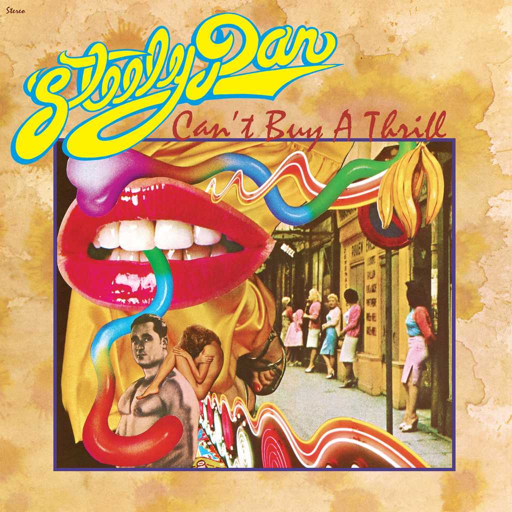
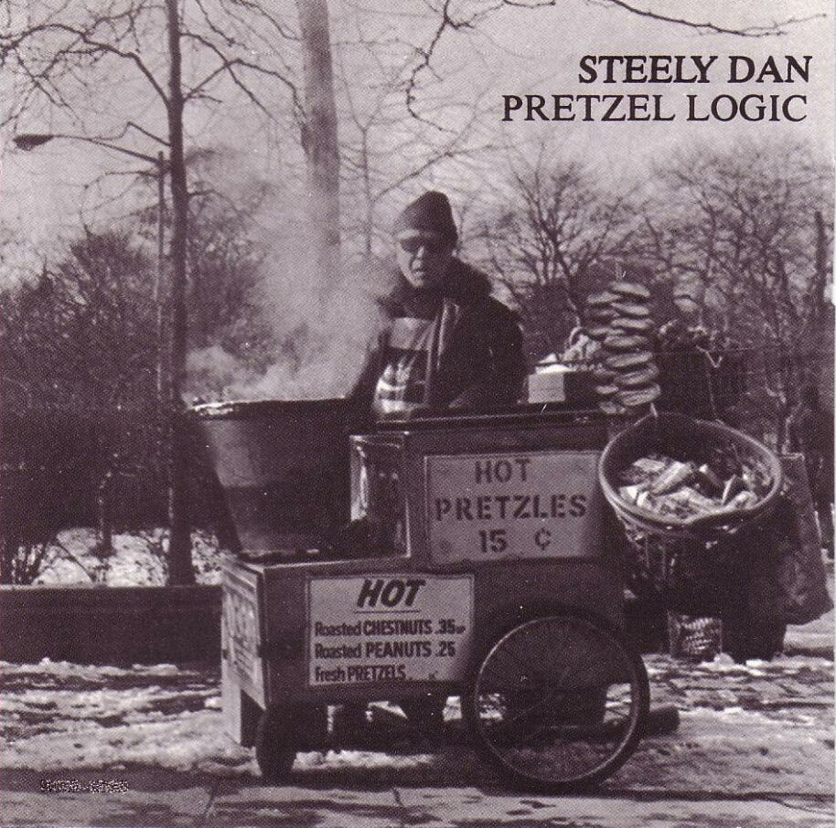
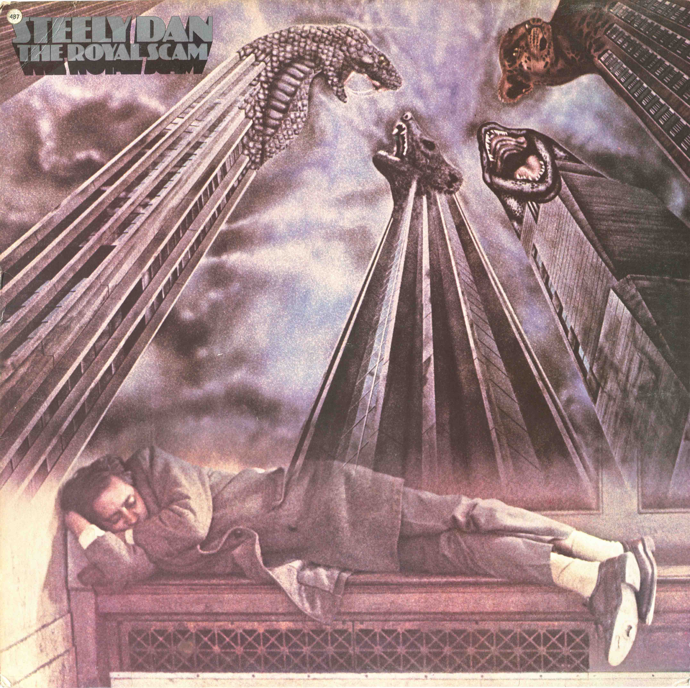
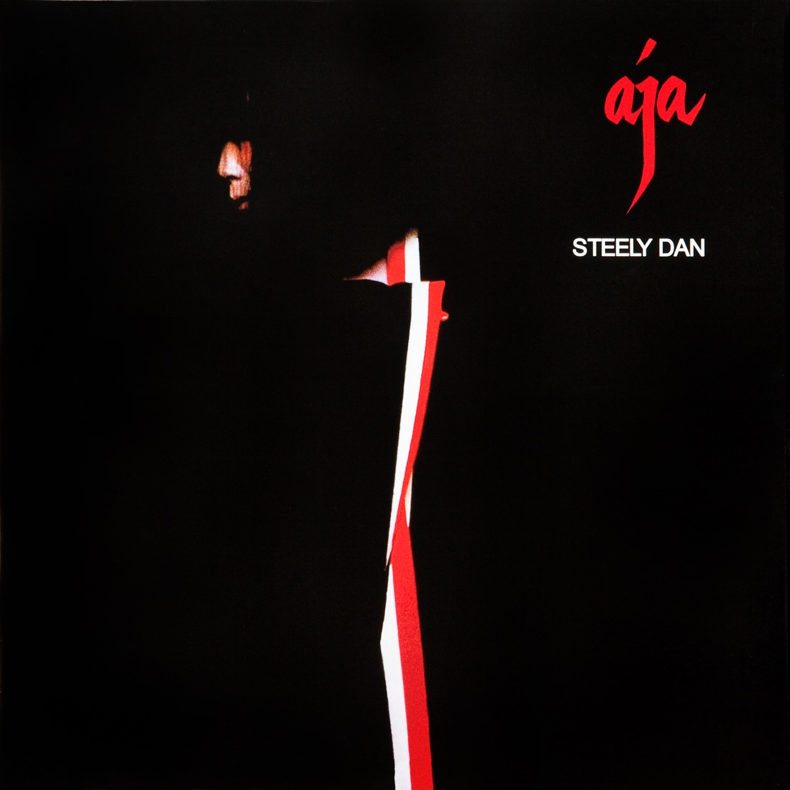

+++
authors = ["Josh"]
title = "Steely Dan"
description = "Pornographic 'Yach Rock' from those who like their music earnestly cynical."
[taxonomies]
music_tags = ["Artist"]
[extra]
hero = false
banner = "the-royal-scam.jpg"
+++

	

		<a href="https://youtube.com/playlist?list=PLG0W27j3Wle3g6aq3sPxazQVQ0vtgfx3P&si=za0qEJxrpp19wN3k" class="album-link" target="_blank" rel="noopener noreferrer">
			
			
Can't Buy a Thrill

		</a>
	

	

		<a href="https://youtube.com/playlist?list=PLGr1IYuG8Wwv0LOsD1PUbjQu3dchzoOAW&si=cBWX4k7_yejJ6UnI" class="album-link" target="_blank" rel="noopener noreferrer">
			
			
Pretzel Logic

		</a>
	

	

		<a href="https://youtube.com/playlist?list=PLfGibfZATlGrvWkpL8_85c3STuNv6d3Cz&si=Om_NzNruFbTGfQuQ" class="album-link" target="_blank" rel="noopener noreferrer">
			
			
The Royal Scam

		</a>
	

	

		<a href="https://youtube.com/playlist?list=OLAK5uy_nNSt2pxzqur9OlUok2h9mJDnHQ1YqFA-8&si=LDPMTeEFm2EXv04s" class="album-link" target="_blank" rel="noopener noreferrer">
			
			
Aja

		</a>
	

Albums: [Can't Buy a Thrill](https://youtube.com/playlist?list=PLG0W27j3Wle3g6aq3sPxazQVQ0vtgfx3P&si=za0qEJxrpp19wN3k), [Pretzel Logic](https://youtube.com/playlist?list=PLGr1IYuG8Wwv0LOsD1PUbjQu3dchzoOAW&si=cBWX4k7_yejJ6UnI), [The Royal Scam](https://youtube.com/playlist?list=PLfGibfZATlGrvWkpL8_85c3STuNv6d3Cz&si=Om_NzNruFbTGfQuQ), [Aja](https://youtube.com/playlist?list=OLAK5uy_nNSt2pxzqur9OlUok2h9mJDnHQ1YqFA-8&si=LDPMTeEFm2EXv04s),

Named after a large silver dildo, Steely Dan are as you might guess rather provocative and unapologetic. Despite what some might consider to be a vulgar or crass band name, the musics about as as smooth as it gets and also pretty refined. These virtues come courtesy of the well thought out arrangements, the best jazz musicians of the time in some of the best studios. Apparently a descriptive term applied to them by a journalist at one point or another was "Yacht Rock", which is quite apt! 
In funny sort of way, Steely Dan are actually kind of like a cynical version of Byran Wilson. The genius is certainly there with their cream of the crop arrangements, artsy lyrics, unusual instruments and so forth - so the real difference is the tone and taste... Dan as you might suspect are less innocent and a dollop more dark.
Album wise the Royal Scam is probably my favourite of the lot, though Aja is one of the most famous. Cherry picking a few songs the likes of "[Dirty Work](https://youtu.be/kR5Ki6jjPaY?si=5KsS8Tbt0auwBTak)", "[Fire in the Hole](https://youtu.be/9PwkU4nsJM8?si=pHYjmMjgM5Byd9TK)", "[Any Major Dude](https://youtu.be/HBzzdlpISFg?si=3_4IFAp1_xuFGCVO)", "[Kid Charlemagne](https://youtu.be/jJ9Xk-VoGqo?si=_eLUN1T_VUdEtdPy)", and "[The Royal Scam](https://youtu.be/4IU1ZdDfXTY?si=QrlzNzeSm6WXhwmo)" come to mind. 