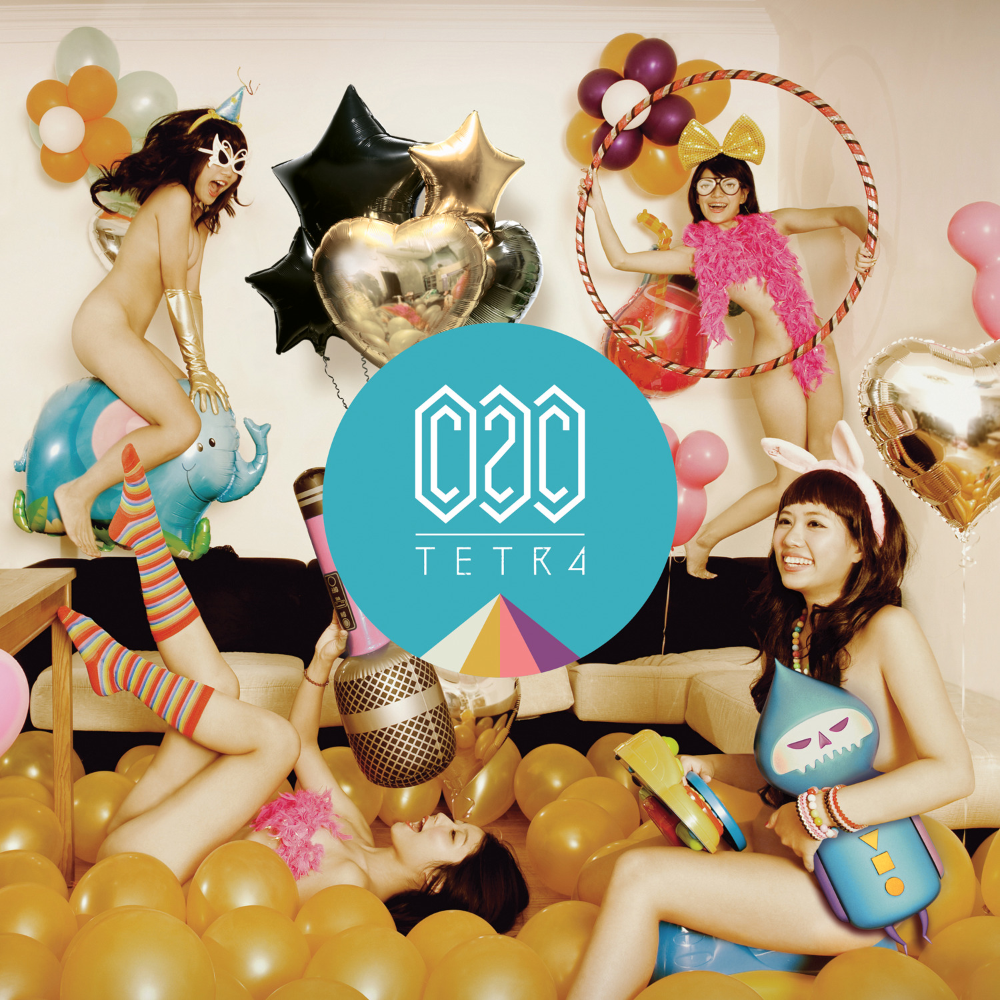
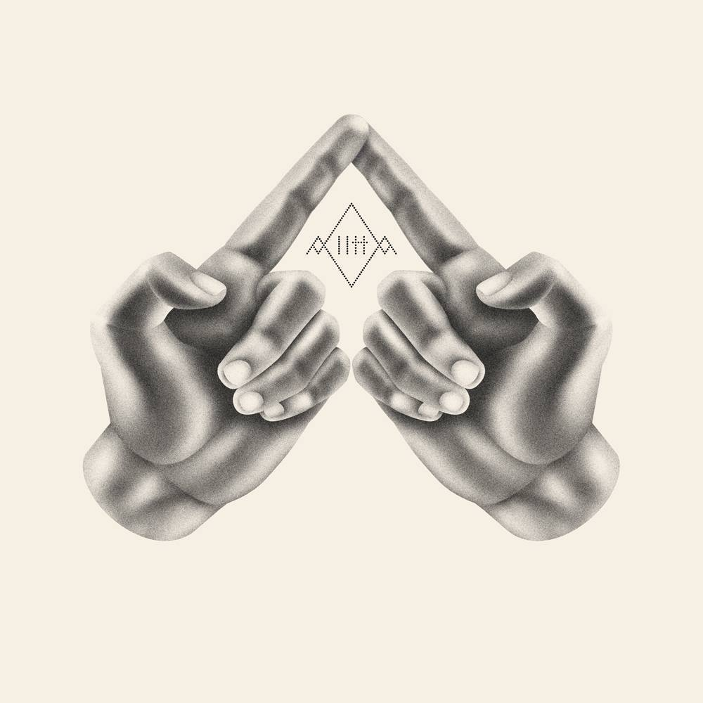

+++
authors = ["Josh"]
title = "Sylvain Richards (20SYL)"
description = "Polymath creator with ears and eyes for detail, never failing to deliver the vibes."
[taxonomies]
music_tags = ["Artist"]
[extra]
hero = false
banner = "tetra.jpg"
+++

	

		<a href="https://youtube.com/playlist?list=PLDD3CE86784811531&si=gPCyjz-DnM5A7q6y" class="album-link" target="_blank" rel="noopener noreferrer">
			
			
Tetra

		</a>
	

	

		<a href="https://youtube.com/playlist?list=PLF3lu5b2iqGUIbDk3k-z3AWL2HUc2hsTP&si=3gryfblm_xkmHSZv" class="album-link" target="_blank" rel="noopener noreferrer">
			
			
The Upper Hand

		</a>
	

Albums: [Tetra](https://youtube.com/playlist?list=PLDD3CE86784811531&si=gPCyjz-DnM5A7q6y), [The Upper Hand](https://youtube.com/playlist?list=PLF3lu5b2iqGUIbDk3k-z3AWL2HUc2hsTP&si=3gryfblm_xkmHSZv)

Sylvain Richard is the multi-potentiate creator behind Hocus Pocus, C2C, 20syl, Alltta and a number of other artistic endevours. He's also a semi-pro skater and screen printer!

The flavour of C2C is pretty characteristic of Richards distinct style but as a team of turntabilists, the group won the World DMC Championship enough times to get banned from competing. The tracks have a flavour of funky electronic disco and seems to satisfy most peoples tastes in any group gathering. It also consistently breaks the mould enough for those who desire texture, novelty and refinement in their music.

Richards other stuff is solid too; most if not all of his productions feel sonically well polished and are often delivered with a simple but well designed and creative video like "[Kodema](https://youtu.be/Mqbw7CUVWhM?si=VGkjP1_jmzoCrYdq)" or "[The Beat](https://youtu.be/2b03hoW0TKc?si=G7jQdyir-36v_V-v)". If you want a groove you'll find that C2C and 20syl has enough rythmic elements churned with modern synthesis to warm up most crowds; for example "[Can You Dance To This](https://tothecosmos.org/ghost/Can%20You%20Dance%20To%20This)"? 

Some other hot picks not to miss out on are "[Down The Road](https://youtu.be/gpc3cCxWNkU?si=ZhFrxSBNV-6Zq3xk)", "[Back & Forth](https://youtu.be/NtjnO-ge6s0?si=wBRvVin0-lCsHnxn)" and "[Le Banquet](https://www.youtube.com/watch?v=4HegFilQ26I)". If you dig lyrics however, Sylvains project with J.D. Mederios (Alltta) is also very much worth checking out; particularly the track "[Disarm](https://youtu.be/9_UFTpfeyIY?si=vgeJv5qunJKQBX0B)" which moves me every listen.