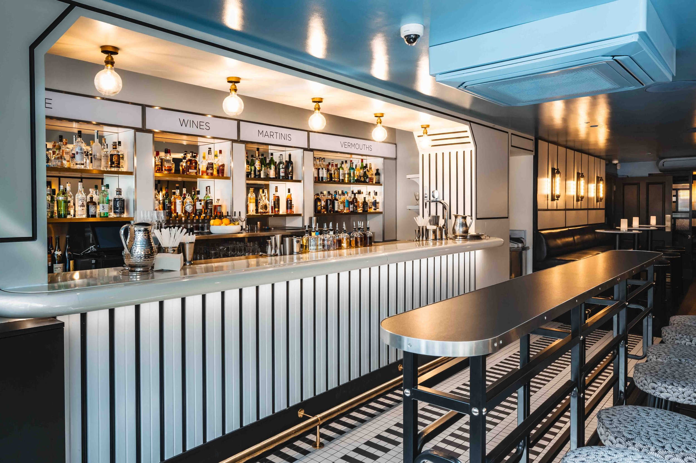

+++
authors = ["Josh Fairhead"]
title = "Swift"
description = "AV installation and technical setup for Swift venue."
date = 2016-01-01
weight = 40
[taxonomies]
tags = ["Audio Visual", "Installation"]
[extra]
hero = false
draft = false
+++

[Swift](http://www.barswift.com/downstairs/)

Technical installation work for Swift venue including audio, visual, and lighting systems.

    

        
    

    

        
    

    

        
    

    

        
    

    

        
    

    

        
    

    

        
    

