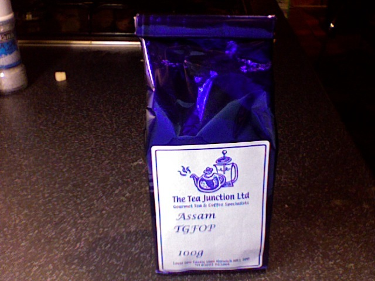

+++
date = 2009-12-05
authors = ["Josh Fairhead"]
title = "Assam T.G.F.O.P."
description = "A decent everyday Assam with enough body to give a kick, featuring woody flavors and slightly above average bitterness at a reasonable price point."
[taxonomies]
tags = ["assam", "tgfop", "estate-unknown"]
[extra]
rating = "6.5/10"
price = "£1.60"
quantity = "100g"
retailer = "The Tea Junction Ltd., Norwich"
original_url = "https://fishkarmatea.blogspot.com/2009/12/assam-tgfop_05.html"
banner = "image1.jpg"
+++

For the price its pretty good but its not excellent. It's got enough body in it to give a bit of a kick but without over powering you. The taste is not quite hitting woody but leaning in that direction. Its slightly above average on the bitter scale but not in a bad way. Long and short of it is that its an all right tea for everyday drinking when you want a bit of a hit and not exactly in the mood to really savour something. Its fine...

## Tea Details
- **Rating:** 6.5/10
- **Price:** £1.60
- **Quantity:** 100g
- **Grade:** T.G.F.O.P. (Tippy Golden Flowery Orange Pekoe)
- **Origin:** Assam (Estate Unknown)
- **Retailer:** The Tea Junction Ltd.
  - Address: Level 2 Castle Mall, Norwich, NR1 3DD, UK
  - Phone: +44 1603 661066
