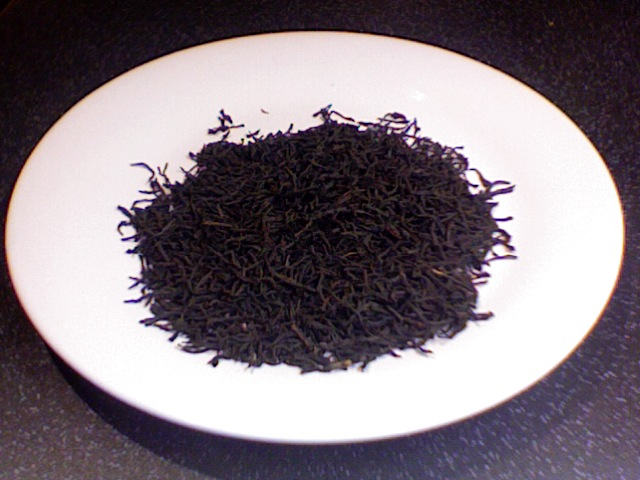
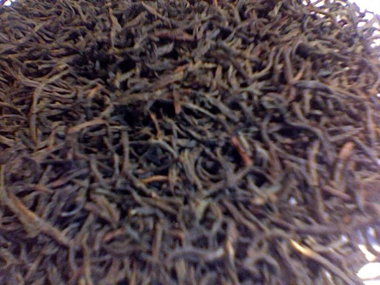

+++
date = 2009-12-05
authors = ["Josh Fairhead"]
title = "Ceylon O.P."
description = "A Ceylon Orange Pekoe with solid initial taste but lacking substance, with an aftertaste that disappears rapidly. Acceptable for the price but not a top choice."
[taxonomies]
tags = ["ceylon", "op", "orange-pekoe", "estate-unknown"]
[extra]
rating = "6/10"
price = "£1.60"
quantity = "100g"
retailer = "The Tea Junction Ltd., Norwich"
original_url = "https://fishkarmatea.blogspot.com/2009/12/ceylon-op.html"
banner = "image1.jpg"
+++

This tea doesn't really have a whole lot to it... There is an intial taste which is rather solid but has no proper substance to it at the same time. The after taste disappears almost instantly but all in all for the price is rather ok. That said I would rather drink something different for day to day drinking (but Celyons are usually my least favorite tea anyway)

## Tea Details
- **Rating:** 6/10
- **Price:** £1.60
- **Quantity:** 100g
- **Grade:** O.P. (Orange Pekoe)
- **Retailer:** The Tea Junction Ltd.
  - Address: Level 2 Castle Mall, Norwich, NR1 3DD, UK
  - Phone: +44 1603 661066
