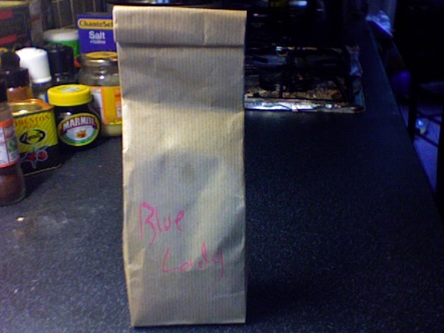
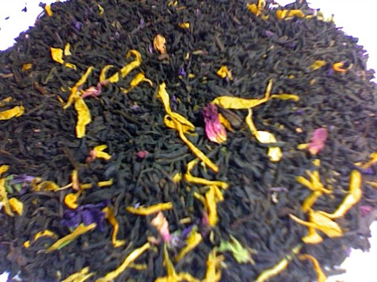

+++
date = 2010-06-06
authors = ["Josh Fairhead"]
title = "Blue Lady"
description = "A delicious Chinese black tea enhanced with orange and citrus flavors, making it suitable for any time of day at a near-reasonable price for regular drinking."
[taxonomies]
tags = ["chinese-black-tea", "citrus", "flavored"]
[extra]
rating = "8/10"
price = "£5.30"
quantity = "100g"
retailer = "Terra Nera Tea Boutique, Camden Market, London"
original_url = "https://fishkarmatea.blogspot.com/2010/06/blue-lady-chinease-black-teacitrus.html"
banner = "image1.jpg"
+++

Lovely flavourful tea thats delicious. The Chinese black tea isn't the greatest but when mixed with the Orange Pettiagalia (just like the passion fruit tea) it gets very nice. Good evening drink but tasty at any time and considering the price its nearly cheap enough to drink on a regular basis.
## Tea Details
- **Rating:** 8/10
- **Price:** £5.30
- **Quantity:** 100g
- **Retailer:** Terra Nera Tea Boutique
  - Location: Camden Market, London, UK
