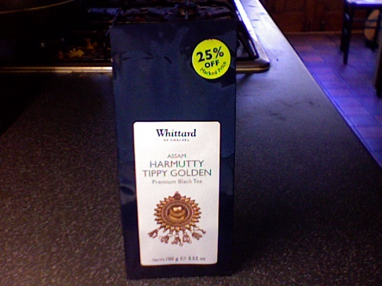
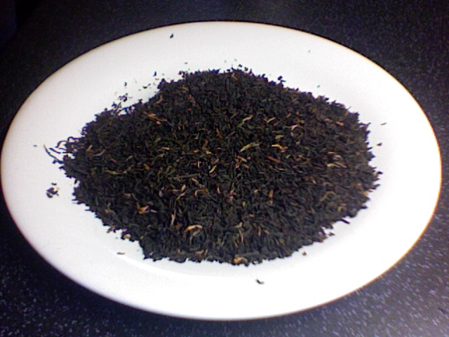

+++
date = 2010-06-06
authors = ["Josh Fairhead"]
title = "Harmutty Tippy Golden Assam"
description = "A disappointing Assam that was very moderate and lacked real taste, reviewed retrospectively after the product was already consumed."
[taxonomies]
tags = ["assam", "tippy-golden"]
[extra]
rating = "Probably 5/10"
price = "£4.50"
quantity = "Not specified"
original_url = "https://fishkarmatea.blogspot.com/2010/06/harmutty-tippy-golden-assam.html"
banner = "image1.jpg"
+++

To be honest I can't really review this since it was a while back that I drank it and took the pictures, its all gone now... Anyway I wouldn't really be to bothered with it, it was very moderate and lacked real taste.
## Tea Details
- **Rating:** Probably 5/10
- **Price:** £4.50 (without 25% discount applied)
- **Retailer:** Whittards
  - Location: Ealing Broadway mall, West London
