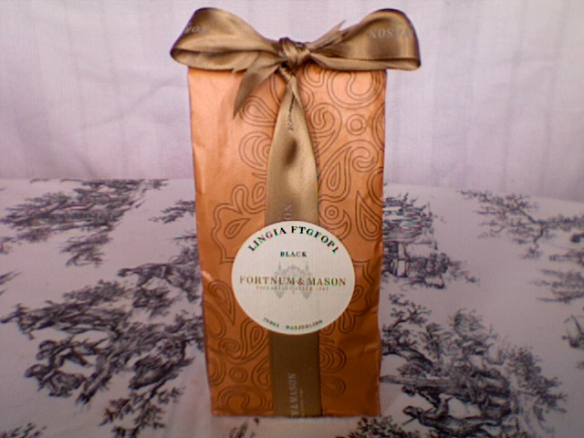
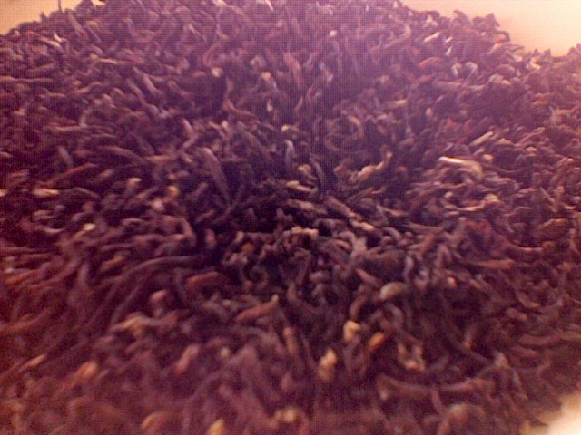

+++
date = 2010-08-12
authors = ["Josh Fairhead"]
title = "Lingia FTGFOP1"
description = "A Darjeeling first flush from Lingia Estate that's decent but overpriced, with adequate strength but lacking notable flavor complexity and a thin taste profile."
[taxonomies]
tags = ["darjeeling", "first-flush", "ftgfop"]
[extra]
rating = "6/10"
price = "£25"
quantity = "200g"
retailer = "Fortnum & Mason, Piccadilly, London"
original_url = "https://fishkarmatea.blogspot.com/2010/08/lingia-ftgfop1.html"
banner = "image1.jpg"
+++

Nice tea, I don't believe it warrants the price (essentially £12.50 for 100g) as I have had other teas that taste a lot better for less (e.g Maharani Hills costing £8 for 125g).
Not too weak in terms of background strength which is a good thing in my books; but still a bit thin tasting lacking a real flavour hit. There is a possibility I'm over brewing this to get some extra body; but brewed any less it would just be too weak for me. I guess thats first flushes for you...

## Tea Details
- **Rating:** 6/10
- **Price:** £25
- **Quantity:** 200g
- **Grade:** FTGFOP1
- **Retailer:** Fortnum & Mason, Piccadilly, London, UK
