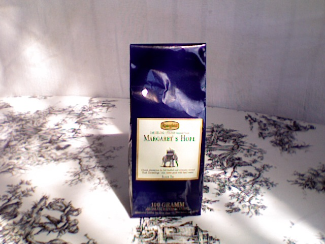

+++
date = 2010-08-22
authors = ["Josh Fairhead"]
title = "Margrets Hope FTGFOP"
description = "A mellow Darjeeling second flush with medium strength, suitable for both day and night drinking. Good for everyday use at a reasonable price."
[taxonomies]
tags = ["darjeeling", "second-flush", "ftgfop"]
[extra]
rating = "7/10"
price = "€4.50"
quantity = "100g"
retailer = "The Quay Food Co., Kinsale, Co. Cork, Ireland"
original_url = "https://fishkarmatea.blogspot.com/2010/08/margrets-hope-ftgfop.html"
banner = "image1.jpg"
+++

So a kinda mellow Darjeeling that tastes pretty much as expected; nothing more, nothing less...
Medium strength thats nice and easy for night time drinking but equally suited to daytime drinking.
If your looking for a morning waker upper then maybe not the best tea for the job. Other than that its pretty good for everyday drinking considering the price.

## Tea Details
- **Rating:** 7/10
- **Price:** €4.50
- **Quantity:** 100g
- **Grade:** FTGFOP
- **Retailer:** The Quay Food Co.
  - Address: Market Quay, Kinsale, Co. Cork, Ireland
  - Phone: +353 21 4774000
