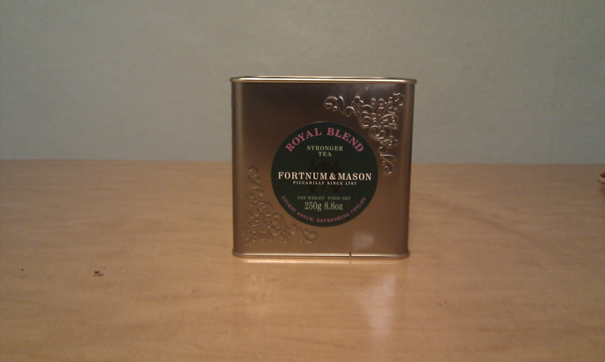
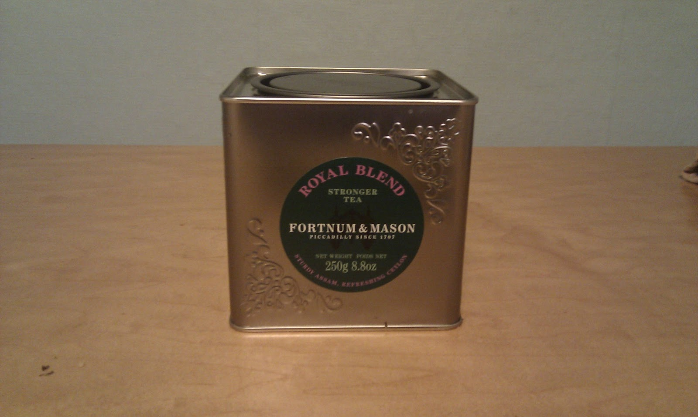

+++
date = 2010-11-29
authors = ["Josh Fairhead"]
title = "Fortnum & Mason Royal Blend"
description = "A blend combining Assam and Ceylon teas from Fortnum & Mason with product photographs but limited review details."
[taxonomies]
tags = ["blend", "assam", "ceylon"]
[extra]
rating = "Not specified"
price = "Not specified"
quantity = "Not specified"
retailer = "Fortnum & Mason"
original_url = "https://fishkarmatea.blogspot.com/2010/11/fortnum-mason-royal-blend-assamcelyon.html"
banner = "image1.jpg"
+++

## Tea Details
- **Tea Type:** Blend combining Assam and Ceylon teas
- **Brand:** Fortnum & Mason
