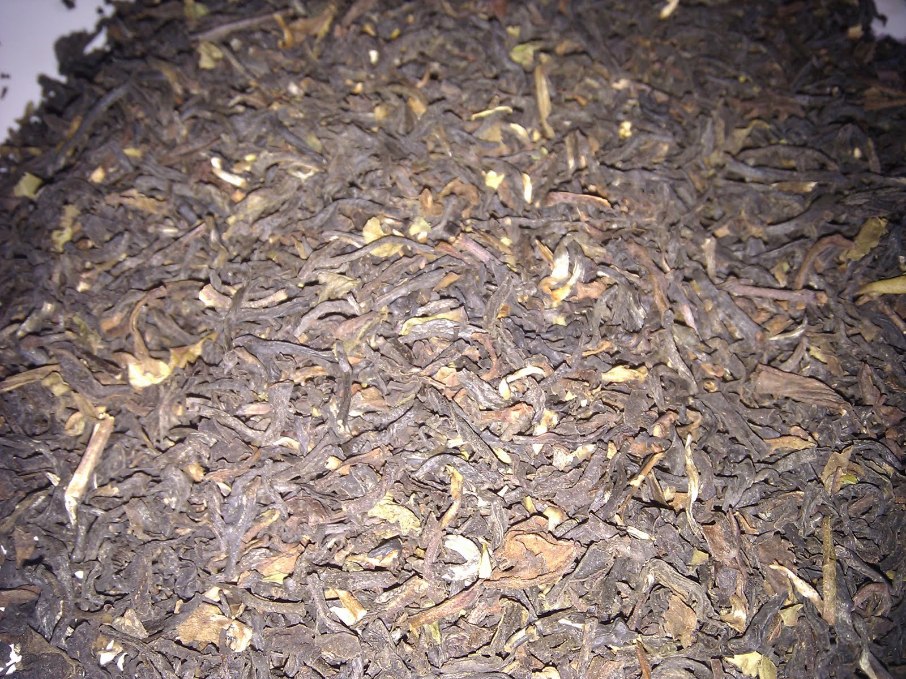

+++
date = 2011-09-14
authors = ["Josh Fairhead"]
title = "Whittards 125th Anniversary Blend"
description = "A blend speculated to combine Ceylon and Darjeeling, delivering full bodied yet light taste with resistance to bitterness and woody-floral character."
[taxonomies]
tags = ["blend", "ceylon", "darjeeling", "anniversary"]
[extra]
rating = "7/10"
price = "£3.50"
quantity = "Not specified"
original_url = "https://fishkarmatea.blogspot.com/2011/09/whittards-125th-anniversary-blend.html"
banner = "image1.jpg"
+++

Although the shop assistant did not know what the blend actually consisted of, I would hazard a guess at it being a Ceylon blend mixed with Darjeeling; it has a full bodied taste while also being relatively light. One nice aspect is that it doesn't get bitter if brewed too long or if left to cool. Overall it has a slightly woody character with floral over tones lending to a nice high-midrange taste.
## Tea Details
- **Rating:** 7/10
- **Price:** £3.50
- **Retailer:** Whittards Ealing
