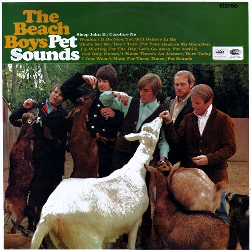

+++
authors = ["Josh"]
title = "Brian Wilson"
description = "Beach boys creative genius and author of one of the most interesting lost albums of all time."
[taxonomies]
music_tags = ["Artist"]
[extra]
hero = false
banner = "smile.jpg"
+++

	

		<a href="https://youtube.com/playlist?list=PLj5TmO4kroQH4XM8P3JavV0p7Gtnno1E2&si=s1o2VfbFTFdpBE8A" class="album-link" target="_blank" rel="noopener noreferrer">
			
			
Pet Sounds

		</a>
	

	

		<a href="https://youtube.com/playlist?list=PLhinduWcIKtFcHEDIQPXXdbFGT8gxTKF1&si=rPcZTkaZfCu9TkGv" class="album-link" target="_blank" rel="noopener noreferrer">
			
			
SMiLE

		</a>
	

Albums: [Pet Sounds](https://youtube.com/playlist?list=PLj5TmO4kroQH4XM8P3JavV0p7Gtnno1E2&si=s1o2VfbFTFdpBE8A), [SMiLE](https://youtube.com/playlist?list=PLhinduWcIKtFcHEDIQPXXdbFGT8gxTKF1&si=rPcZTkaZfCu9TkGv)

You know the Beach Boys right? Well Brian Wilson was arguably the driving talent behind most of their sucess; he wrote most of the songs, the arrangements, hired the musicians and ran the studio production. Obviously "[Pet Sounds](https://youtube.com/playlist?list=PLj5TmO4kroQH4XM8P3JavV0p7Gtnno1E2&si=s1o2VfbFTFdpBE8A)" was the album that reached fame and critical acclaim due to the pioneering studio productions on the hit "[Good Vibrations](https://youtu.be/apBWI6xrbLY?si=kOLkjBi9cSyXYpMj)".

What many people don't know however is that there was a follow up album that made use of the same pioneering techniques as "[Good Vibrations](https://youtu.be/apBWI6xrbLY?si=kOLkjBi9cSyXYpMj)" that was was LOST for 40 years. This was Brians masterpiece, which finally saw the light of day in 2004. Naturally, there's an incredible story behind the albums history, with several documentaries like "[Beautiful Dreamer](https://www.youtube.com/watch?v=JETqt5e5OQQ)" available that one should really take the time to watch for themselves. As such, I'll leave that aspect alone. 

Anyway, thanks to members of "[The Wondermints](https://www.youtube.com/watch?v=-9K-YmhCmlA)" helping Bryan get back on track - particularly Darian Shanana - the 2004 version SMiLE is frankly the most spiritual album your likely to find for miles; the ProTools recording is an audiophiles wet dream with luscious vocal harmonies, wall of sound instrumental arrangements (inclusive of barritone harmonicas) and a brilliant sense of psychedelic humour! 

As a concept album, there are several elemental themes woven into the albums fabric. For me the water sections transition between "[Child is Father of the Man](https://www.youtube.com/watch?v=MCoweCaRn5U&list=OLAK5uy_mR9pK5phEHUR__YHG9xj4rgPwzmDQpKt4&index=9)" and "[Surfs Up](https://www.youtube.com/watch?v=MCoweCaRn5U&list=OLAK5uy_mR9pK5phEHUR__YHG9xj4rgPwzmDQpKt4&index=9)" has a shimmering depth, thanks to the Stockholm Strings and their emotive glissando's. Theres plenty of substance to the album, just get in for a swim!

---

<!---

<h3 style="text-align: center;">SMiLE - Brian Wilson (1968/2004)</h3>
 This is a brilliantly recorded album that seems almost flawless. Given the amount of musicians to record and mix and the modular structuring of the album, Mark Linett the engineer behind the whole thing must of had his work cut out in creating such a beautiful recording.  The music is also first rate with instruments drifting in and out of the arrangements, building upon each other and breaking down again often straying down a musical path that catches you off guard but leaving you very pleased it did so.

SMiLE has a long and interesting history often being referred to as Brian Wilsons 'teenage symphony to god', because of  various statements he made at the original time of writing (1968) about one day writing 'music people would pray to'. However this album is not so much religious in the direct sense of the word and aimed to be more spiritual; the first song 'Our prayer' is a wordless six part harmony acapella that conveys such a great feeling that if church was anything like it I might be tempted to go...

The album is arranged around seemingly three movements; 'Our Prayer' to 'Old Master Painter', 'Cabin Essence' to 'Surf's Up' and 'I'm in Great Shape' through to 'Good Vibrations' all of which containing some really nice arrangements. I find the second movement the most interesting in which the building vocal harmonies of 'Child is Father of the Man' fall into a wonderful Stockholm strings section that contains a wailing horn who's melody line just keeps falling further than you expect; snaps of such musical genius occur very rarely in this world. The banjos melody in 'Cabin Essence" along with the bass harmonica that crops up occasionally for a bar are both further examples of production genius in this section.  The transition from the end of 'On a Holiday' into 'Wind Chimes' is also pretty well done in respect to the floating vocal harmonies moving into a hypnotic xylophone piece.

Aside from 'Vega-Tables" cropping up two song previously, 'Wind Chimes' seems like the real start to 'The Elements' movement which progresses to 'Mrs. O'Leary's Cow', a musical representation of fire that seems fairly spot on if you ask me... The fire section after pretty much burning itself out is doused and crackles out into the swirly vocal intro of 'In Blue Hawaii' (the water section) which turns suddenly tropical. One thing that I really love at the end of this song is the brief return of the 'Our Prayer' acapella before moving into 'Good Vibrations'; this really brings the album full loop before the 'repeat setting' kicks in playing the album from the start again without you noticing!  Overall its a very theatrical album and a modern example of truly outstanding production, composition, recording and mixing. Its very hard to find something that lives up to this standard in all respects so if you've never the album heres some links to some stand out songs:

Child is Father of the Man: <a href="http://www.youtube.com/watch?v=oTA2o9YiCfM">http://www.youtube.com/watch?v=oTA2o9YiCfM
</a>Surf's Up: <a href="http://www.youtube.com/watch?v=b-n83crO0rY">http://www.youtube.com/watch?v=b-n83crO0rY</a>

*** update.
I recently bought this album on record and it sounds amazing. There are also instrumentals of a few tracks on the end of the record showing off Brian's compositional skills (there ridiculously elaborate considering they are somewhat masked by 6-12 part vocal harmonies).

***update 2.
It seems that Capitol are soon to release the 1968 recordings as Brian's recently given them his consent to do so.

--->