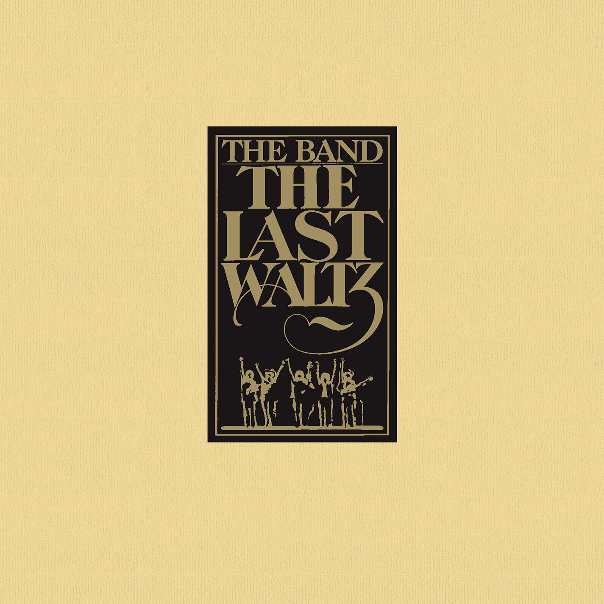

+++
authors = ["Josh"]
title = "The Band"
description = "One of the most prolific working bands of the 60's and 70's and the spirit of Woodstock."
[taxonomies]
music_tags = ["Artist"]
[extra]
hero = false
banner = "the-last-waltz.jpg"
+++

	

		<a href="https://youtube.com/playlist?list=PLE31AAD9114F343C4&si=912hiqEoUy9lhl0p" class="album-link" target="_blank" rel="noopener noreferrer">
			
			
The Brown Album

		</a>
	

	

		<a href="https://youtube.com/playlist?list=PLEvr99j7ruPwC5VgxJBdWD7l3bILNPqOp&si=SC9DjOeZpiQV0SDP" class="album-link" target="_blank" rel="noopener noreferrer">
			
			
Music From Big Pink

		</a>
	

	

		<a href="https://youtube.com/playlist?list=OLAK5uy_kC5lOLC7LQc7kscZs--dvJORnxgZKOA8c&si=9jvwW-aW6e36siYM" class="album-link" target="_blank" rel="noopener noreferrer">
			
			
Northern Lights - Southern Cross

		</a>
	

	

		<a href="https://youtube.com/playlist?list=PLi307k6VzjI-d0kVSNgL0lUMLEuP9WQPA&si=AoFCNFlAzNFKOi1y" class="album-link" target="_blank" rel="noopener noreferrer">
			
			
The Last Waltz

		</a>
	

The Band
Albums: [The Brown Album](https://youtube.com/playlist?list=PLE31AAD9114F343C4&si=912hiqEoUy9lhl0p), [Music From Big Pink](https://youtube.com/playlist?list=PLEvr99j7ruPwC5VgxJBdWD7l3bILNPqOp&si=SC9DjOeZpiQV0SDP), [Northern Lights - Southern Cross](https://youtube.com/playlist?list=OLAK5uy_kC5lOLC7LQc7kscZs--dvJORnxgZKOA8c&si=9jvwW-aW6e36siYM), [The Last Waltz](https://youtube.com/playlist?list=PLi307k6VzjI-d0kVSNgL0lUMLEuP9WQPA&si=AoFCNFlAzNFKOi1y).

These guys really were a potent brew of gifted musicians, starting out with [Ronnie Hawk](https://youtu.be/OZeDvbyaJA4?si=J8g7mQu4KjQvDwIy) before joining [Bob Dylan](https://youtu.be/jtFEzhaNrT4?si=MrgIRyrYoVJ4u4UN) when he went electric. They basically knew everyone that was anyone in the 60's and 70's as exemplified in "[The Last Waltz](https://youtube.com/playlist?list=PLi307k6VzjI-d0kVSNgL0lUMLEuP9WQPA&si=AoFCNFlAzNFKOi1y)" (Maritn Scorsese) which has them sharing the stage with the former names as well as [Neil Young](https://youtu.be/J2z7LXpAX3Q?si=t6sXVjZDHSAKtuV4), [Joni Mitchel](https://youtu.be/f7MbmXklj3Q?si=spNckDHD8U73I3V9), [Van Morrison](https://youtu.be/44wDwMQVqCc?si=A6iecszP4lyvGHbC), [Neil Diamond](https://youtu.be/RurccWvJiS8?si=kq3shBF8_slm_9Od), [Muddy Waters](https://youtu.be/E5Sj5tpn-no?si=lBgvE97fiMhy8P12), [Eric Clapton](https://youtu.be/1WDmMWF83x4?si=VpNqYG3M8SiFGe0E), [Dr. John](https://youtu.be/SCRrXZP8b0I?si=U599lcxEU7-zahE0), [Ronnie Wood](https://youtu.be/K3fq7yAdKM4?si=kUYLABmq-f9VuHfE), [Ringo Star](https://youtu.be/K3fq7yAdKM4?si=kUYLABmq-f9VuHfE), [Paul Butterfield](https://youtu.be/ekGh9qzmQlI?si=-raAxvADF9AfmTr_) and [Emmylou Harris](https://youtu.be/RujpSQ5n0J8?si=vEyHlgM8NclTG-Ei). 

Neil Youngs cocaine moustache on his performance of "[Helpless](https://youtu.be/J2z7LXpAX3Q?si=loSeeox3sKnizmnb)" was apparently one of the most expensive video edits of the time. "I got it now Robbie", he says after an off pitch tune up before he quickly manages to turn things around. Joni Mitchell helps as a backing singer. This tune with Joni Michell on backing is certainly one of the gigs highlights along with "[Caravan](https://youtu.be/44wDwMQVqCc?si=oIl8DFBtgoo5s7rA)", "[The Night They Drove Old Dixie Down](https://www.youtube.com/watch?v=6dDbnwQlCek)", "[The Weight](https://youtu.be/Z2eTW8qZBtk?si=q9neiR9WZl9-4WlA)" and many of the bands other original songs like "[Arcadian Driftwood](https://www.youtube.com/watch?v=cSZv3cOI4kI)".