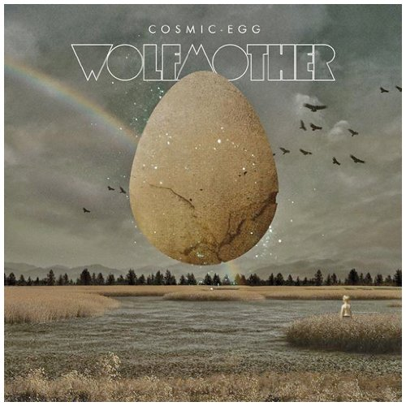

+++
authors = ["Josh"]
title = "Wolfmother"
description = "Australian reinvention of the Brit rock classics, with a modern edge."
[taxonomies]
music_tags = ["Album"]
[extra]
hero = false
banner = "cosmic-egg.jpg"
+++

	

		<a href="https://youtube.com/playlist?list=PLncz40_G09q955eCOFpEsDL7AznHH9hTO&si=5iCf-nvAfWerM047" class="album-link" target="_blank" rel="noopener noreferrer">
			
			
Cosmic Egg

		</a>
	

Album: Cosmic Egg

Oxymoronically, "[Cosmic Egg](https://youtube.com/playlist?list=PLncz40_G09q955eCOFpEsDL7AznHH9hTO&si=5iCf-nvAfWerM047)" is what might be called contemporary classic rock; if you like layers of multi-tracked guitars, this albums full of psychedelic phasers, wah peddles and possibly double necked Gibson SGs. In other words its guitar hero stuff all the way through and there's a generous sixteen tracks on offer that hold consistent in their quality.

They have been criticised for reinventing the wheel, which I personally felt when I first heard them, but honestly that's pretty much the issue with classic rock - it's set in stone. After listening through a couple of times the album really grew on me and I'll happily say that Wolfmother are innovating in a field with little room left to maneuver - Cosmic Egg being the jewel in their discography. 

Personally speaking, I'm favorable to the ralentandos (tempo shifts) and arpeggios on "[Eyes Open](https://youtu.be/HXIPUjvFchk?si=TjCCuuxKleBtBPdF)" and "[Violence of the Sun](https://youtu.be/aHmc7XzW8DA?si=BPGiPeB3tXxsrm1F)". They are just all too satisfying. 