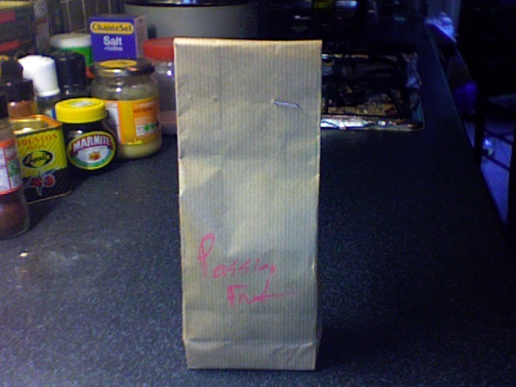
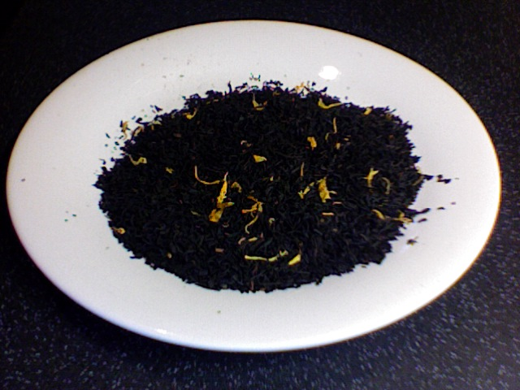

+++
date = 2010-06-06
authors = ["Josh Fairhead"]
title = "Passion Fruit Tea"
description = "A summer tea with passion fruit flavors that intensify and become sweeter as it cools, featuring a Chinese black tea base that blends well with other teas."
[taxonomies]
tags = ["flavored", "fruity", "chinese-black-tea", "passion-fruit"]
[extra]
rating = "6/10"
price = "£4.70"
quantity = "100g"
retailer = "Terra Nera Tea Boutique, Camden Market, London"
original_url = "https://fishkarmatea.blogspot.com/2010/06/passion-fruit-tea.html"
banner = "image1.jpg"
+++

Very round and light, a real summer tea. The passion fruit flavour really comes out as the tempreture drops; getting sweeter as it cools to a nice tempreture to drink at. The Chinese black tea could be better quality but if combined with the Orange Pettiagalla Celyon from a couple of posts ago it can taste pretty damn good. Another good addition to this combination is The Blue Lady tea, which in the right quantaties works pretty well.
## Tea Details
- **Rating:** 6/10
- **Price:** £4.70
- **Quantity:** 100g
- **Retailer:** Terra Nera Tea Boutique
  - Location: Camden Market, London, UK
